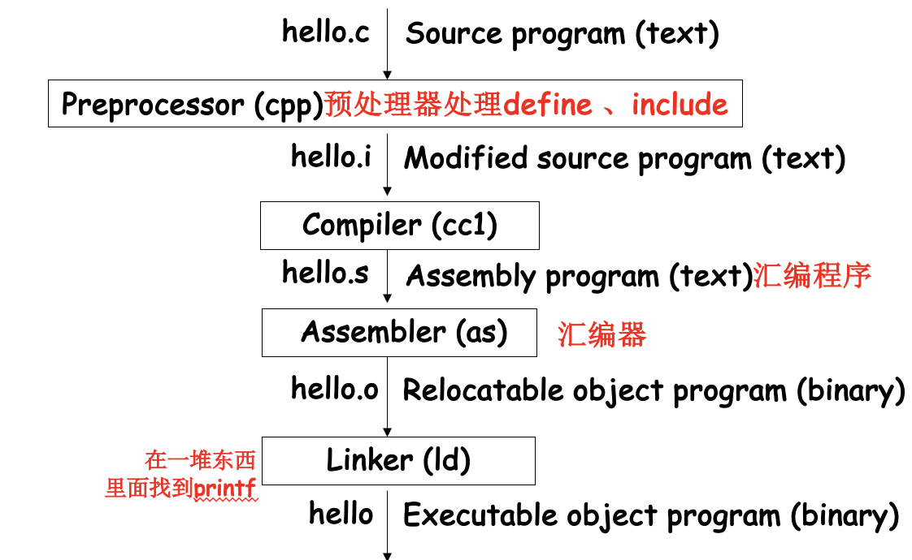
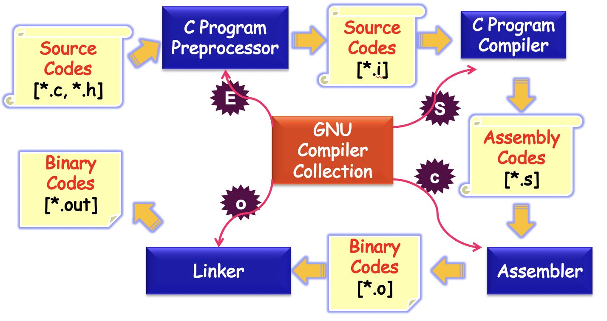
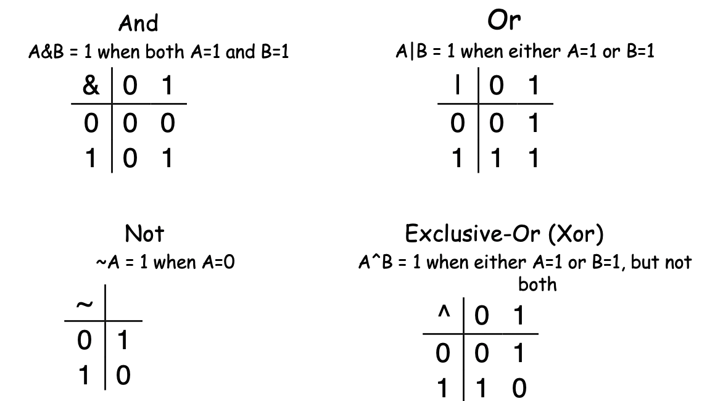
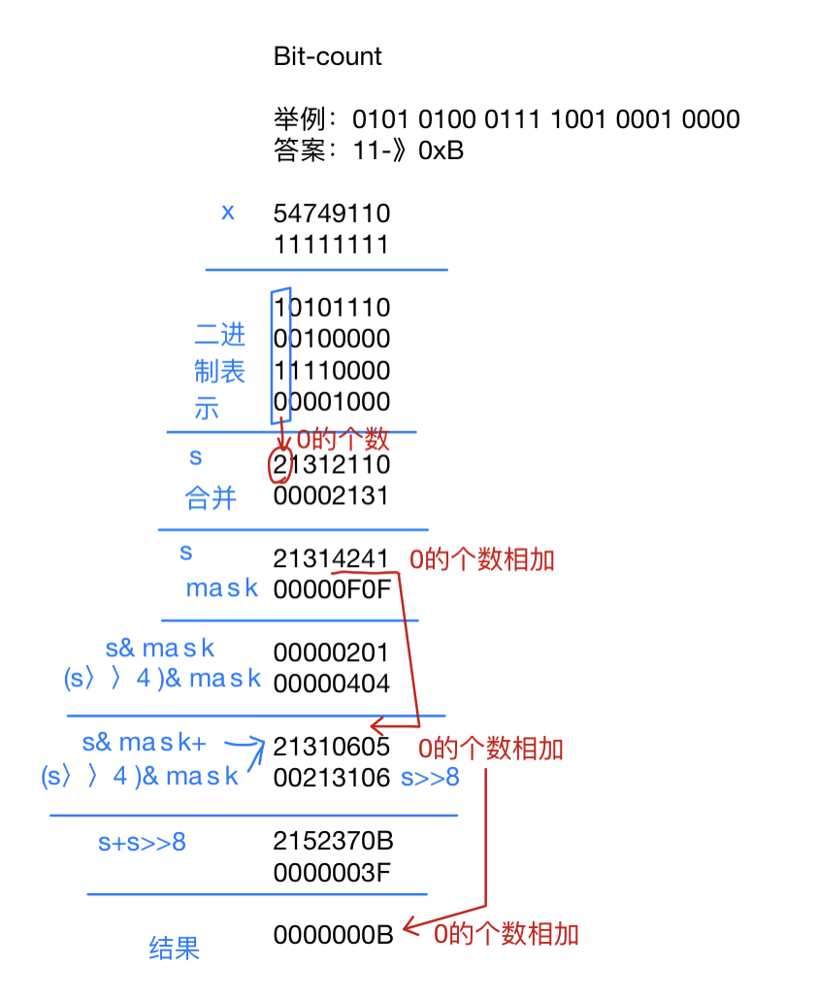
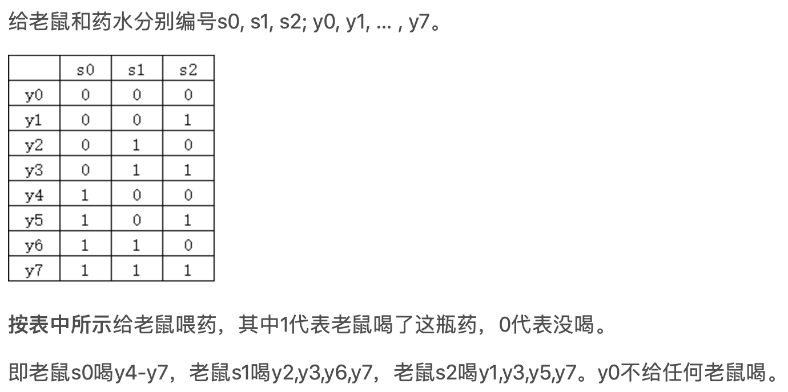
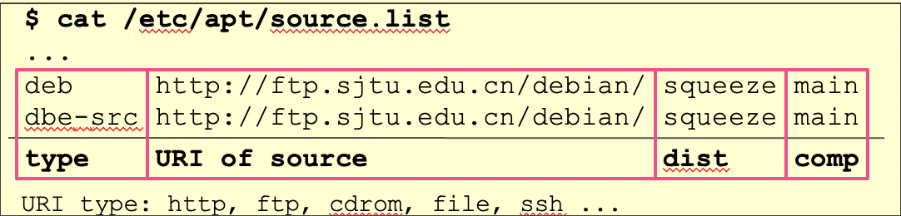
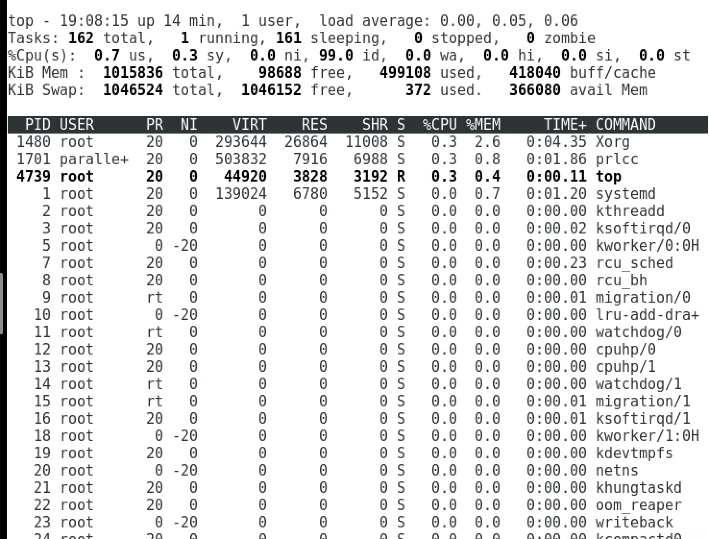
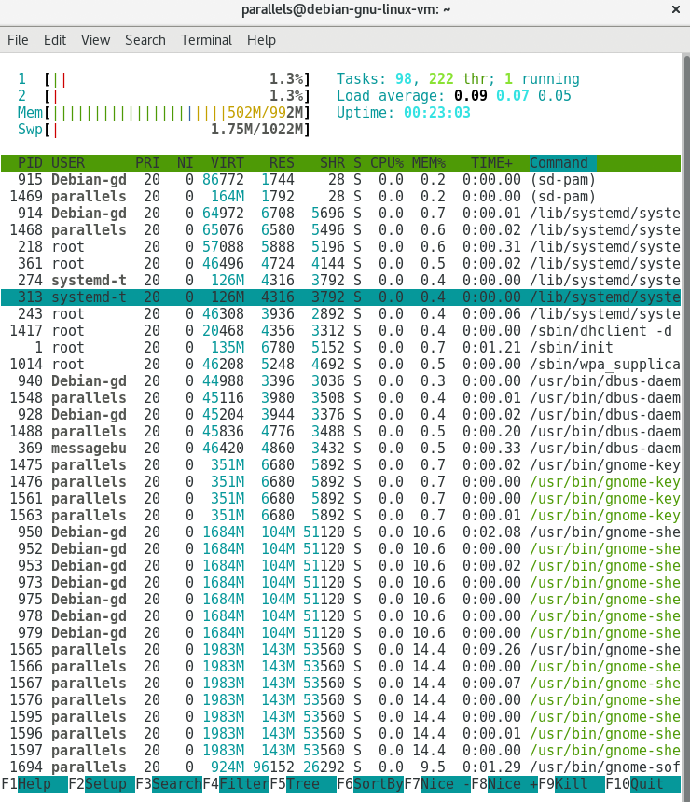
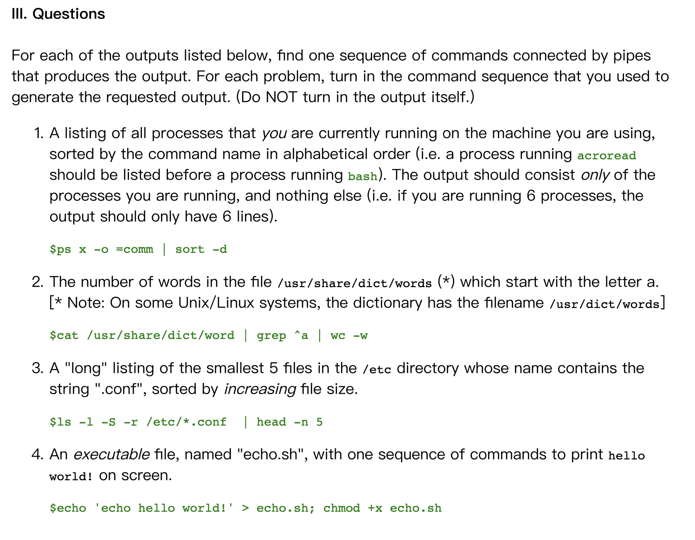
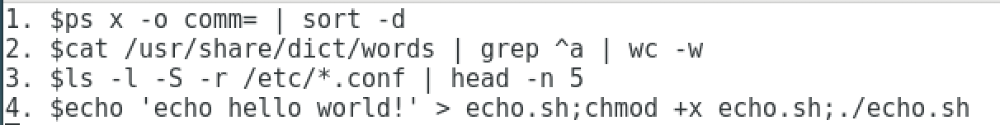

# Note of CSAPP

[TOC]


## Introduction

1. **Layer of computer system** 

Computer Hardware --><u>Operating system（IOS··） -->Utilities(工具) --> Application Programs</u>

Underline -->computer sysmtems

2. **Programmers Have to Understand Their Machines and Their Limitations**

–Correctness: computer arithmetic, storage allocation

–Efficiency: memory & CPU performance

3. **Enduring Concepts（不变的概念）& Changing Specific implementations（变化的实现）**

计算机——人工智能实验室

4. **It covers a topic only if it affected（应用层）**

   **–correctness, performance or utility of user-level C programs** 

5. Suggested reading

–Preface 7-8, 1.2, 1.4.1, 1.7(before 1.7.1), 1.7.3, 1.8,    1.9.1 (the first paragraph), 4 asides in chapter 1

6. 操作系统历史

   1. Fernado Jose Corbató  **Multics**

   2. Brian Kernighan  **Unix**, Dennis Ritchie发明了C
   3. Linus Torvalds **Linux**，bash(1.08), gcc(1.40)

7. Utility（工具）

8. C 

   1. C is the language of choice for system-level programming
9. DOS是DiskOperationSystem（磁盘操作系统）

### 上课考试信息

第一组 东下院303 上机有test

Labs  (30%)
1: Bits 
2: Bomb *
3: Buffer Overflow *

* Online Test
* lab2,3 有一个在线测试，考23的内容，不根据lab评分

Exams  (70%)
Final
Quiz 

可以多次提交，若最后一次提交有问题，可以找前面对的版本，第一个lab 至少提交3次

SJTU Depository  <u>ftp://ftp.sjtu.edu.cn/</u> 
e.g.  Debian-9.4.0/debian-cd/9.4.0/amd64/iso-dvd/

Online: get the official web-site by google
e.g.  Debian  (/'dɛbiːjən/, Debra + Ian) http://www.debian.org/distrib/

## Representing Information

### 进制

打结——一进制  二进制——Bit  十进制——digit/decimal    八进制 ——octal 十六进制——Hexadecimal 

8bits →byte（人的易读性）

#### 进制转换

$$
\begin{array}{r}
Bits &01010\\

Value &0*24+1*23+0*22+1*21+0*20 = 10
\end{array}
$$

$$
辗转相除法\begin{array}{r}
value:\quad 102(1100110) \\
Bits:\quad 102=51 * 2+0 \\
51=25 * 2+1 \\
25=12 * 2+1 \\
12=6 * 2+0 \\
6=3 * 2+0 \\
3=1 * 2+1 \\
1=0 * 2+1
\end{array}
$$

#### Hexadecimal(16进制)0x 


Use characters **‘0’ to ‘9’ and ‘A’ to ‘F’**，十六和二进制，4个切开转化即可

> Write FA1D37B16 in C as 
>
> -  **0x**FA1D37B or
>
> - **0x**fa1d37b

**进制转化表（背）**


**内存限制带来的编码问题**

超过了限度，编码混乱，但是交换律结合律还是成立的。

200\*300\*400\*500 = -884,901,888

- (3.14+1e20)-1e20 = 0.0 

  - [ ] （参考2.4）

  1e20+3.14 因为太长了导致3.14被切掉了

- 3.14+(1e20-1e20) = 3.14


File Inclusion and Macro Substitution（宏替换）

#### 文件存储

1. Source program

   以ascII 码组成的 text file（可读懂） 构成

   Binary file

2. Not text file

•Begins life as a high-level C program

–Can be read and understand by human beings 

•The individual C statements must be translated by<u>(gcc) *compiler drivers*</u>

–So that the hello program can run on a computer system


### 编译流程

The C programs  $\rightarrow$ A sequence of low-level *machine-language* instructions $\rightarrow$ object program  $\rightarrow$ a binary disk file(*executable object files*)






### 位运算Boolean Algebra



位运算可以看成是每一位进行bool 代数运算，也可以看成是集合的运算

> •01101001 { 0, 3, 5, 6 } 定义0在的位，放在一个集合
>
> •01010101 { 0, 2, 4, 6 }
>
> -  & Intersection 01000001 { 0, 6 }集合交
>
> - | Union 01111101 { 0, 2, 3, 4, 5, 6 }集合并
>
> - ^ Symmetric difference  00111100 { 2, 3, 4, 5 }
>
> - Complement   10101010 { 1, 3, 5, 7 }
>
> 
>

**异或Xor  交换**

```C++ 
int inplace_swap(int *x, int *y)
{
  *x = *x ^ *y;  /* #1 */
  *y = *x ^ *y;  /* #2 */
  *x = *x ^ *y;  /* #3 */
}
```


### Mask Operation

1. **设置1，0**

   or T 可以设1，~+or T 设置0

   The least significant byte set to all 1s, and all other bytes of x left unchanged.

   x | 0xFF

2. **异或，取补集**

   0^1=1 1^1=0 所以用1起到了补集的作用

   1^0=1 0^0=0 和原来一样，所以起到了保留的作用

   •All but the least significant byte of complemented, with the least significant byte left unchanged

   翻译为:除了最后的一个byte保留不变，其他的都取补集

   - x ^ ~0xFF

   

3. **取位数，&1111····**

- X & 0xFF =?

  取得最后8位，比如后八位代表了特殊意义。

- 取8，16，32的全1

  ```
  int x;
  x=~0;
  ```

### Logical Operations –&&,||,!

**性质**

 • View 0 as “False”
 • Anything nonzero as “True”
 • Always return 0 or 1
 • Early termination (short cut)

F=0；其他的都是1

> !0x41 --> 0x00
>
> !0x00 --> 0x01
>
> !!0x41 --> 0x01
>
> 0x69 && 0x55 --> 0x01
>
> 0x69 || 0x55 --> 0x01

**Short Cut** 

如果能判定真值，停止计算。

1. 避免0分母  a && 5/a

2. 避免空指针 p && *p

3. **异或，判同、判0**

   !(x^y)相同为1，相反为0


### Shift Operations 

**Left Shift:  x << y**   

x左移y位。超出的就不要了
$$
\begin{aligned}
&\begin{array}{|l|l|}
\hline \text { Argument } x & 01100010 \\
\hline<<3 & 00010000 \\
\hline
\end{array}\\
&\begin{array}{|l|l|}
\hline \text { Argument } x & 10100010 \\
\hline<<3 & 00010000 \\
\hline
\end{array}
\end{aligned}
$$
**Right Shift:  x >> y**

Shift bit-vector x right y p

**逻辑右移**

前面填写0
$$
\begin{array}{|l|l|}
\hline \text { Argument } x & 01100010 \\
\hline \text { Log. }>>2 & 00011000 \\
\hline \text { Arith. }>>2 & 00011000 \\
\hline
\end{array}\\
$$
**算数右移**

前面的看最高位，前面填写的和最高位一样，这个和负数有关，最高位是符号位。
$$
\begin{aligned}

&\begin{array}{|l|l|}
\hline \text { Argument } & 10100010 \\
\hline \text { Log. }>>2 & 00101000 \\
\hline \text { Arith. }>>2 & 11101000 \\
\hline
\end{array}
\end{aligned}
$$
**移动比加减的优先级更低**

–1<<2 + 3<<4 means 1<<(2 + 3)<<4 

### bitCount问题

```C++
int bitCount(int x) {
	int m1 = 0x11 | (0x11 << 8); 
  int mask = m1 | (m1 << 16); 
  int s = x & mask;
	s += x>>1 & mask;
	s += x>>2 & mask;
  s += x>>3 & mask;
  
  /* Now combine high and low order sums */ 
  s = s + (s >> 16);
  /* Low order 16 bits now consists of 4 sums.
  Split into two groups and sum */
	mask = 0xF | (0xF << 8); 0F0F
	s = (s & mask) + ((s >> 4) & mask); 
  return (s + (s>>8)) & 0x3F;
  }
```

本质：1. 用 & 一步一步把1取出来 2. 4个4个，两个两加和



老鼠喂药问题

给10只老鼠和1000瓶药水，1瓶是毒药。

解法：老鼠的死亡、活着是0-1的状态，可以用10个bit进行编码。一共有2^10=1024的可能性。每个药水对应一个编码，最后映射一下结果即可。



### Byte Ordering

Little Endian
 – Least significant byte has lowest address

Big Endian
 – Least significant byte has highest address

Bi-Endian

–  Machines can be configured to operate as either little- or big-endian

–  Many recent microprocessors


## Endianness and Character Data

Single-byte character data such as ASCII and Latin-1 is not affected by Endianness. If you store any ASCII character string in memory, it always looks the same, <u>no matter what the Endianness of the hardware,</u> since each character is one byte long and the start character of the string is always stored at the lowest memory location. For the string "abcd", the "a" is stored "first", i.e.

字符串的存储和endianness无关，因为是单个char存储的


### How to Access an Object（program）

如何访问一个程序？

1. 每个程序获得一段虚拟内存空间
2. C compiler 产生机器级别的program
3. C 指针的值是这段地址的第一个值（地址最小，但是具体的byte的值是看大头还是小头）


### C语言补充

1. sizeof():	32位，64位的普适性代码

```c
void show_int(int x) { 
  show_bytes((byte_pointer) &x, sizeof(int));
}
```

使用sizeof(int)就在两个机器的运行结果都一样了。

2. typedef

### Representing Strings

```c
int strlen(char *s) {
char *p = s ;
while (*p != ‘\0’) p++ ;
return p-s ; }
```

```C
int trim(char s[]) {
int n;
for (n = strlen(s)-1; n >= 0; n--)
	if ( s[n] != ‘ ‘ && s[n] != ‘\t’ && s[n] != ‘\n’)break; 
s[n+1] = ‘\0’;
return n }
```


# 上机

### Linux 环境

```bash
cat
chmod ——修改文件权限
echo
grep  ——文字检索
head  ——显示开头或结尾某个数量的文字区块
ls
ps    ——查看服务器的进程信息
sort  ——字段排序
wc    c——统计指定文件中的字节数、字数、行数，word count
su    ——进入root 最高权限
```

**网络连接：**

NAT模式：被包在host 操作系统里面，没有IP（常用）

Bridge模式：内部系统也有IP

#### **命令行常用**

**运行**

./xx(文件名).sh

./xx.c

**ls 展示**

ls -1 | more 

-1 表示一行只有一个文件。more ：一次展示一页，按空格下翻

ls -1 | grep p | more

显示标题含有p 的可执行文件

**cd   进入**

进入ls -a 产生的带.的隐藏目录，前面的路径多了/.


**pwd**  

产生当前的绝对路径，即当前的terminal所在的路径

**echo**

echo $PATH 

- 显示所用的command 的路径


参考：

> https://blog.csdn.net/weixin_33849942/article/details/93021669?biz_id=102&utm_term=pwd%20和%20echo%20path&utm_medium=distribute.pc_search_result.none-task-blog-2~all~sobaiduweb~default-0-93021669&spm=1018.2118.3001.4187

echo 会将输入的字符串送往标准输出。


```
echo hello A
```

将字符串hello A输出到屏幕

```
echo hello A > tmp.txt
```

将字符串输出重定向，当前目录没有tmp.txt，则创建tmp.txt，并将字符串输出到tmp.txt文件中 tmp.txt内容：hello A

```
echo hello B > tmp.txt
```

将字符串输出重定向， 当前目录存在tmp.txt，则将tmp.txt内容替换成输出的字符串  tmp.txt内容：hello B

```
echo hello C >> tmp.txt
```

将字符串输出追加重定向，当前目录存在tmp.txt，则将tmp.txt的内容后面追加输出的字符串  tmp.txt内容：hello B hello C


**mkdir XX**   

在当前路径下创建文件名为XX的文件夹。用ls之后，文件夹是蓝色的，文件是黑色的


**touch X Y Z ...**  

创建文件名为X、Y、Z的文件

- cat
  1.一次显示整个文件。
  cat   filename

  2.从键盘创建一个文件。只能创建新文件,不能编辑已有文件.
   cat  >  filename
  3.将几个文件合并为一个文件。
  cat   file1   file2  > file

  

- ```bash
  $ cp /bin/ls ./myls
  $ ./myls
  ```

- | 用来串联多个命令，前面的output 会变成后面的input

**sort**

```bash
-b：忽略每行前面开始的空格字符,空格数量不固定时,该选项几乎是必须要使用的("-n"选项隐含该选项，测试发现都隐含)
-c：检查文件是否已经按照顺序排序，如未排序，会提示从哪一行开始乱序
-C：类似于"-c"，只不过不输出任何诊断信息。可以通过退出状态码1判断出文件未排序
-d：只处理英文字母、数字及空格，忽略其他的字符
-f：将小写字母视为大写字母
-h：使用易读性数字(例如:2K、1G)
-i：除了040至176之间的ASCII字符外(八进制0-177)，忽略其他的字符(忽略无法打印的字符如退格/换页键/回车)
-k：以哪个区间 (field) 来进行排序
-m：将几个排序好的文件进行合并，只是单纯合并，不做排序
-M：将前面3个字母依照月份的缩写进行排序
-n：依照数值的大小排序
-o<输出文件>：将排序后的结果存入指定的文件
-r：降序
-u：忽略相同行
-t<分隔字符>：指定分隔符，默认的分隔符为空白字符和非空白字符之间的空字符
```

**sort的工作原理**

sort将文件的**每一行作为一个单位**，相互比较，比较原则是从**首字符向后，依次按ASCII码值进行比较**，最后将他们按升序输出。

APT (Advanced Package Tools)
A management system for software packages
Package resource list for APT:  
/etc/apt/sources.list



每行是一个源 Dist:版本，squeeze 是debian8的名字

#### cp命令复制文件

使用pwd 命令查明当前路径

假设复制源目录 为 dir1 ,目标目录为dir2。
如果dir2目录不存在，则可以直接使用
cp -r dir1 dir2
即可。
如果dir2目录已存在，则需要使用
cp -r dir1/. dir2


举例：

```bash
parallels@debian-gnu-linux-vm:~/icslabs/lab1$ cp -r /home/parallels/icslabs/lab1 /home/parallels/lab1
```

删除

```bash
# 删除整个文件夹
 rm  -r  homework  
# 删除文件
 rm  test.txt 
```


### APT 软件管理工具

/etc/apt/sources.list

### SVN 版本控制

进入

```
svn co svn://ipads.se.sjtu.edu.cn/ics-se19/ics518431910002 icslabs --username=ics518431910002

cd icslabs
```

查看状态

```bash
svn status
```

提交

```bash 
 svn ci helloworld.c --message="finish helloworld program."
```

版本回退

```bash
svn up -r [版本号，写的时候去掉方括号]
```

**bug：**

https://forum.vivaldi.net/topic/20688/annoying-enter-password-to-unlock-your-login-keyring-on-debian-linux/6

> **[ugly](https://forum.vivaldi.net/user/ugly)** [2017年9月8日 下午9:22](https://forum.vivaldi.net/post/159315)
>
> 
>
> This is what I did to solve the issue on Linux Mint. I saw this somewhere else, and I'm no expert, so I don't know if this is the safest thing.
>
> rm -v ~/.local/share/keyrings/*.keyring
>
> Next restart when prompted for keyring click continue and leave everything blank.

#### top & htop

**top**



**htop**



**区别：**htop是交互式的，可以点击进程进行管理,top只是单纯的列表


question: svn 搜出来好多，怎么找呢？






### Debugging

gdb

studio

```
#include "stdio.h"
int main()
{
    float a=1;
    printf("%f",a);
    
}
```

exit 退出root

### Docker

```bash 
docker start ubuntu

docker exec -it ubuntu /bin/bash

```

## lab1

### README

The ICS: Data Lab
Directions to Students

Your goal is to modify your copy of bits.c so that it passes all the
tests in btest without violating any of the coding guidelines.

***********************************************************
1. Modifying bits.c and checking it for compliance with dlc
***********************************************************

Carefully read the instructions in the bits.c file before you
start. These give the coding rules that you will need to follow if you
want full credit.

Use the dlc compiler (./dlc) to automatically check your version of
bits.c for compliance with the rules:

        unix> ./dlc bits.c

dlc returns silently if there are no problems with your code.
Otherwise it prints messages that flag any problems.  Once you have a
legal solution, you can test it for correctness using the ./btest
program.

*************************************
2. Testing for correctness with btest
*************************************

The Makefile in this directory compiles your version of bits.c with
additional code to create a program (or test harness) named btest.

Give the command:

        unix> make

to compile the code.

Run the program with the command:

        unix> ./btest [optional command line arguments]

When moving from one platform to another, you want to get rid of the
old version of btest and generate a new one.  Use the commands:

        unix> make clean

*******************
3. What btest does
*******************

Btest tests your procedures for correctness by running a number of test
cases.  It does not guarantee exhaustive evaluation.  In addition, it does
not check your code for compliance with the coding guidelines.  Use dlc to
do that.

If you think the functions provided in btest are incorrect send mail
to the lead person for this assignment.

Here are the command line options for btest:
   -e N     Limit number of errors to report for single function to N
            (Default unbounded)
   -f Name  Check only the named function
   -g       Prints concise report (implies -v 0 and -e 0)
   -h       Print the list of options
   -v N     Set verbosity to level N
            N=0 Only give final scores
            N=1 Also report individual correctness scores (default)

