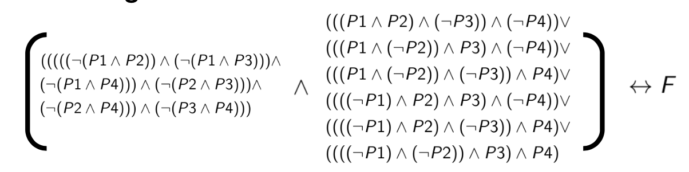
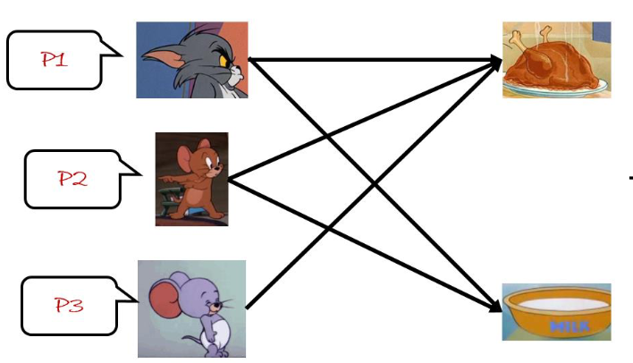

# Note of Discrete Mathematics

[TOC]

### 本课词汇

1.Propositional 命题

2.semantic 语义的

## 1. Overview

1. References

• **Stanford CS103,** **https://web.stanford.edu/class/cs103**

• **NYU G22.2390-001,** **https://cvc4.cs.stanford.edu/logic/** • CMU CDM http://www.cs.cmu.edu/~cdm/

• UB CS70 http://inst.eecs.berkeley.edu/~cs70/fa16/
 • CMU-CS122 https://www.cs.cmu.edu/~iliano/courses/17F-CMU-CS122/

• **Stanford CS103,** **https://web.stanford.edu/class/cs103**

• CMU 15-453 https://www.cs.cmu.edu/~fp/courses/flac/
 • Columbia, COMS W3261, http://www.cs.columbia.edu/~aho/cs3261/ • IITJodhpur,CS222,http://krchowdhary.com/toc/cs222.html
 • 南京大学离散数学课程


2. To Be Distinguished, You Need To

Take

- ✓  Lectures

- ✓  Recitation (Optional)

  

  Do

- ✓  3 Labs

- ✓  Preliminary Questions

- ✓  Homework

  Pass
   ✓ Quiz

  ✓ Finalexam

### Grading Breakdown

- Others 20%
- Lab 20%
- Quiz 20%
- Final 40%


### Faculty Information

**Lecturer**

Zhaoguo Wang (王肇国) zhaoguowang@sjtu.edu.cn

Zeyu Mi (糜泽羽) yzmizeyu@gmail.com

**TA**

Haoran Ding (丁浩然) nhaorand@sjtu.edu.cn

Yuqi Hu (胡雨奇) yuki.h@sjtu.edu.cn

### 网站

Website:

http://ipads.se.sjtu.edu.cn/courses/cdm

Canvas:

https://oc.sjtu.edu.cn/courses/24410

形式化验证网站：

https://rise4fun.com/Dafny/tutorial

### Three Parts of CDM(*)

 Part I. Reasoning. (*8 ~ 9 Weeks*)

How to prove the correctness?

Part II. Computability. (*~ 6 Weeks*)
 Is the problem computable (solvable)?

Part III. Probability. (~*1 Weeks*)

How does computer solve continuous problem? (Underneath the ML)

### Textbooks

《数理逻辑与集合论》第2版 • 石纯一 著，清华大学出版社

John E. Hopcroft, Rajeev Motwani and Jeffrey D. Ullman, Introduction to Automata Theory, Languages, and Computation, Pearson, 2001

### 移位运算符

左移（<<）

i = i << n ;  相当于 i = i * (2  ^ n )

右移（>>）

i = i >> n ;  相当于 i = i / ( 2 ^ n ) 

### 位运算符  与（&）运算符  异或^

&

位操作中的与操作运算符。也就是常说的and操作，双目运算符。
计算的时候按位计算，&两边操作数对应位上全为1时，结果的该位值为1。否则该位值为0
比如0x12&0x23 转为二进制为:B00010010&B00100011，按位计算结果为B00000010，
即结果为0x02


^

两个二进制操作数对应位相同为0，不同为1;


**异或交换取值**

```C++ 
void swap(int a, int b)
{
	a ^= b;
	b ^= a; 
	a ^= b;
}
```


<u>参考：</u>

https://blog.csdn.net/mofeigege/article/details/106304076?ops_request_misc=%257B%2522request%255Fid%2522%253A%2522159995841819725222400123%2522%252C%2522scm%2522%253A%252220140713.130102334..%2522%257D&request_id=159995841819725222400123&biz_id=0&utm_medium=distribute.pc_search_result.none-task-blog-2~all~top_click~default-1-106304076.first_rank_ecpm_v3_pc_rank_v2&utm_term=位运算符&spm=1018.2118.3001.4187


https://jingyan.baidu.com/article/a3f121e4919494fc9052bb0f.html


### question

Three Parts of CDM CDM：computer Discrete Mathematics?

(Underneath the ML):Machine Learning?


**形式化验证举例：**

```C++ 
method clone(n: nat) returns (b : nat)
ensures b == n
{
var i := 0;
while i < n
invariant 0 <= i && i <= n
{
i := i + 1;
}
return i; }
```


## 2. Propositional Logic

教材《数理逻辑与集合论》1.1-1.3、1.5、2.3-2.4

### 概念：

1.  A **proof** is an argument that demonstrates why a conclusion is true, subject to certain standards of truth.

2. A **mathematical proof** is an argument that demonstrates why a <u>mathematical</u> statement is true, following the rules of mathematics. 


3. A **proposition(命题)** is a statement that is, by itself, either true or false.

   > Questions ，commands, exclamations are not propositions.
   >
   > eg.
   >
   > Tom is taller than Jerry √
   > 2 + 2= 4							√
   > N >6            					X（这个是不能判断的，没有确定N的范围）
   > Discrete mathematics is edible 3 is odd √
   >
   > 请问“这句话是错的”是命题吗？（提示：这是一个悖论）X 无法判断正误

4. **Propositional logic** (命题逻辑) is a mathematical system for reasoning about propositions and how they relate to one another.

   Every formula in propositional logic consists of **propositional variables(命题变量)** combined via **propositional connectives（命题连接词）.**

   **propositional variables(命题变量)**：simple propositions

   **Atomic Proposition (**原子命题**)**：无连接词的命题P、Q

   **propositional connectives（命题连接词）**：**NOT、 AND 、OR、Implication →、Biconditional Connective(双条件词)**

   

$$
\begin{array}{clc}
\hline P & Q & P \rightarrow Q \\
\hline \mathrm{T} & \mathrm{T} & \mathrm{T} \\
\mathrm{T} & \mathrm{F} & \mathrm{F} \\
\mathrm{F} & \mathrm{T} & \mathrm{T} \\
\mathrm{F} & \mathrm{F} & \mathrm{T} \\
\hline
\end{array}
$$

$$
\begin{array}{cccc}
\hline P & Q & P \leftrightarrow Q & (P \rightarrow Q) \wedge(Q \rightarrow P) \\
\hline \mathrm{T} & \mathrm{T} & \mathrm{T} & \mathrm{T} \\
\mathrm{T} & \mathrm{F} & \mathrm{F} & \mathrm{F} \\
\mathrm{F} & \mathrm{T} & \mathrm{F} & \mathrm{F} \\
\mathrm{F} & \mathrm{F} & \mathrm{T} & \mathrm{T} \\
\hline
\end{array}
$$

### Modern Proofs Method

Direct Proof.

Proof By Contradiction. （反证法）

Proof By Induction.(归纳法)

Case By Case（枚举）

### Well-Formed Formulas (合式公式)

**INDUCTIVE DEFINITION of WFF（循环定义）**

1). 简单命题是is WFF.
 2). If *A* and *B* are WFF, so are (¬A), (A ∧ B), (A ∨ B), (A →B), and (A ↔ B).
 3). No expression is WFF unless forced by 1) or 2).

### Completeness Of Connectives(联结词完备性)

**定义：**

任意一个联结词可以看出一个真值表对应的一个返回值为bool函数（n 元）可以转化用一组定义的联结词组合而成的函数

**表示：**

<u>方法1：</u>**1.**找到所有的 T 	 **2.** 将P或者Q使用取反，得到 T ∧ T →T	 **3.** 使用V 连接

解释，∧ 只有一种可能性是T，所以再用V并起来，就是所有的T了

PS：如果没有TorF，则构造

P ∧ $\neg P$ =F   

P V $\neg P$ =T

<u>方法2：</u> **1.**找到所有的F  **2.** 将P或者Q使用取反，得到 F ∨ F→F **3.** 使用∧ 连接

**举例：**
$$
\begin{array}{cccc}
\hline \mathrm{P} & \mathrm{Q} & g_{0}(P, Q) & g_{1}(P, Q) \\
\hline \mathrm{F} & \mathrm{F} & \mathrm{T} & \mathrm{T} \\
\mathrm{F} & \mathrm{T} & \mathrm{T} & \mathrm{T} \\
\mathrm{T} & \mathrm{F} & \mathrm{F} & \mathrm{F} \\
\mathrm{T} & \mathrm{T} & \mathrm{T} & \mathrm{F}
\end{array}
$$

$$
\begin{array}{l}
g_{0}(P, Q)=(((\neg P) \wedge(\neg Q)) \vee((\neg P) \wedge Q)) \vee(P \wedge Q) \\
g_{1}(P, Q)=((\neg P) \wedge(\neg Q)) \vee((\neg P) \wedge Q)
\end{array}
$$

$$
\begin{array}{l}
g_{0}(P, Q)=((\neg P) \vee Q)\\
g_{1}(P, Q)=((\neg P) \vee Q) \wedge((\neg P) \vee(\neg Q)) 
\end{array}
$$

例题：
$$
\begin{aligned}
&\text { 对于由 n 个命题变元构成的命题公式, 可能的真值表有（） 种。 }\\
&n\\
&2^{n}\\
&n !\\
&\bullet2^{2^{n}}
\end{aligned}
$$

$$
\begin{aligned}
&\text { 一个命题公式依赖于 n 个命题变元，那么真值表的行数是（） 。 }\\
&n !\\
&n\\
&\bullet 2^{n}
\end{aligned}
$$

### 独立完备集

最优完备集合$\neg \wedge $或者$\neg \vee$ ，因为$P\vee Q= \neg(\neg P \wedge \neg Q)$

完备集和举例：
$$
\begin{aligned}{}
&\{\neg, \vee\}，\{\neg, \wedge\}\\
&\{\neg, \rightarrow\} \quad\neg (\neg P\rightarrow Q )=\vee\\
&\{\downarrow\}(或非) A\downarrow B = \neg A \wedge \neg B \\
&\{\uparrow\}(与非) A\uparrow B = \neg A \vee \neg B \\
prove:\\

&\neg A =A\downarrow A \\
& A \vee B = \neg (\neg A \wedge \neg B ) = \neg(A\downarrow B)

\end {aligned}
$$
不完备集合举例：
$$
\{\vee, \wedge\}\{\neg, \leftrightarrow\} \quad 不可以，因为这两个的标志是FFF，TTT，都是同时成立的
$$


### 合式公式化简，运算律

1. **连接符的优先级，左结合**

$$
\neg>\wedge>\vee>\rightarrow>\leftrightarrow\\
P\rightarrow Q \rightarrow R = (P\rightarrow Q)\rightarrow R
$$

2. **Propositional Equivalences(等值)⟺**

$$
P=Q \text { or } P \Leftrightarrow Q
$$

定义：有相同的真值表

3. **Equivalence Theorem**(等值定理)**:** 𝑃 = 𝑄 iff 𝑃 ⟷ 𝑄 is always true.

4. **De Morgan‘s Laws(摩根律)**

$$
\neg(P \wedge Q)=\neg P \vee \neg Q, \neg(P \vee Q)=\neg P \wedge \neg Q
$$

5. **Double Negation**(双重否定律)**:** ¬¬𝑃 = 𝑃

6. **Associative Law**(结合律)**:** 
   $$
   \begin{array}{c}
   (P \vee Q) \vee R=P \vee(Q \vee R) \\
   (P \wedge Q) \wedge R=P \wedge(Q \wedge R) \\
   (P \leftrightarrow Q) \leftrightarrow R=P \leftrightarrow(Q \leftrightarrow R) \\
   (P \rightarrow Q) \rightarrow R \neq P \rightarrow(Q \rightarrow R)\\
   这里注意：汤姆猫的例子
   \end{array}
   $$

7. **Commutative Law**(交换律)**:**

$$
\begin{aligned}
P \vee Q &=Q \vee P \\
P \wedge Q &=Q \wedge P \\
P \leftrightarrow Q &=Q \leftrightarrow P\\
P \rightarrow Q &\neq Q \rightarrow P \\
\end{aligned}
$$

8. **Idempotent Law**(等幂率)**:**

$$
\begin{array}{l}
P \vee P=P \\
P \wedge P=P \\
P \leftrightarrow P=T \\
P \rightarrow P=T
\end{array}
$$

9. **Identity Law (同一律)：**

$$
\begin{array}{l}
P \vee F=P \\
P \wedge T=P \\
T \rightarrow P=P \\
T \leftrightarrow P=P \\
P \rightarrow F=\neg P \\
F \leftrightarrow P=\neg P
\end{array}
$$

9. **Complementary Law（补余律）：** 

$$
\begin{array}{l}
P \vee \neg P=T（*） \\
P \wedge \neg P=F （*）\\
P \rightarrow \neg P=\neg P \\
\neg P \rightarrow P=P \\
P \leftrightarrow \neg P=F
\end{array}
$$
10. **Zero Law （零律）：**

$$
\begin{array}{l}
P \vee T=T \\
P \wedge F=F \\
P \rightarrow T=T \\
F \rightarrow P=T
\end{array}
$$

11. **Distributive Law（分配律）:**

$$
\begin{array}{l}
P \vee(Q \wedge R)=(P \vee Q) \wedge(P \vee R) \\
P \wedge(Q \vee R)=(P \wedge Q) \vee(P \wedge R)
\end{array}
$$
12. **Absorption Law（吸收律）:**

$$
P \vee(P \wedge Q)=P
$$
$$
P \wedge(P \vee Q)=P
$$

13. $P \rightarrow Q = \neg P \vee Q $  

14. 异或(不可兼或)：$\overline{\text{V}}= （\neg A \wedge B ）\vee (\neg B \wedge A)$
    $$
    \begin{array}{clc}
    \hline P & Q & P\overline{\vee}Q \\
    \hline \mathrm{T} & \mathrm{T} & \mathrm{T} \\
    \mathrm{T} & \mathrm{F} & \mathrm{F} \\
    \mathrm{F} & \mathrm{T} & \mathrm{F} \\
    \mathrm{F} & \mathrm{F} & \mathrm{T} \\
    \hline
    \end{array}
    $$
    

    

    

### 真实问题的逻辑表示

**流程：**1.找到命题变量 2.写出WWF  3.化简得到答案

二皇后问题
$$
\begin{array}{|c|c|}
\hline P 1 & P 2 \\
\hline P 3 & P 4 \\
\hline
\end{array}
$$
放置条件$\wedge$ 必须放两个



证明  $P \wedge \neg P$ = F

### Exercise

$$
\begin{array}{c}
P \rightarrow Q=\neg Q \rightarrow \neg P \\
P \rightarrow(Q \rightarrow R)=Q \rightarrow(P \rightarrow R) \\
P \rightarrow(Q \rightarrow R)=(P \wedge Q) \rightarrow R
\end{array}
$$


Hint:$P \rightarrow Q = \neg P \vee Q $

下面联结词中哪个是不完备的 （D ）
$$
\begin{aligned}{}
&\{\neg, \vee\}\\
&\{\neg, \rightarrow\} \quad\neg (\neg P\rightarrow Q )=\vee\\
&\{\neg, \wedge\}\\
&\{\vee, \wedge\} \quad 不可以，因为这两个的标志是FFF，TTT，都是同时成立的
\end {aligned}
$$


question:区别究竟是什么？？


### 匹配问题

tom、jerry 吃鸡：T，吃milk :F ,nibble 吃鸡：true



条件：

1. Nibbles must eat chicken.P3
2. Chicken cannot be shared.

$$
\neg(P 1 \wedge P 2) \wedge  \neg(P 2 \wedge P 3) \wedge \neg(P 1 \wedge P 3) 
$$

3. Milk cannot be shared.$\neg(\neg P 1 \wedge \neg P 2)$

总结：
$$
\begin{aligned}
&P 3 \wedge \neg(P 1 \wedge P 2) \wedge  \neg(P 2 \wedge P 3) \wedge \neg(P 1 \wedge P 3) \wedge  \neg(\neg P 1 \wedge \neg P 2)

\end{aligned}
$$


证明：

1. $\neg(\neg P 1 \wedge \neg P 2) = P1 \vee P2$

2. $P3\wedge \neg(P 2 \wedge P3)=P3 \wedge(¬𝑃2∨¬𝑃3)=P3 \wedge¬𝑃2$

3. 重复2

   

### Tautology(重言式/永真式)

$$
P \vee \neg P\\
P \vee T \\
\neg(A \wedge B) \leftrightarrow(\neg A \vee \neg B)
$$

### Contradiction(矛盾式/永假式)

$$
\begin{array}{l}

P \wedge \neg T \\
P \wedge F  \\

\end{array}
\\
(P \leftrightarrow Q) \leftrightarrow((P \wedge \neg Q) \vee(Q \wedge \neg P))
$$

