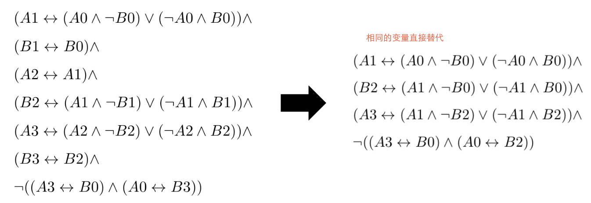
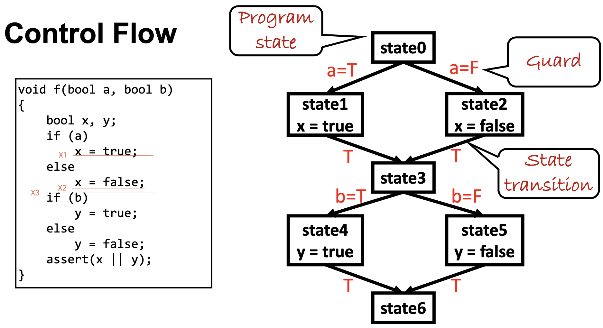
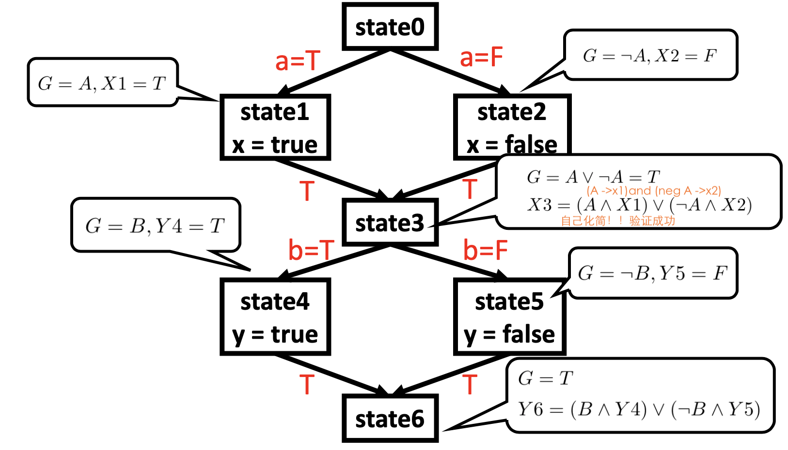
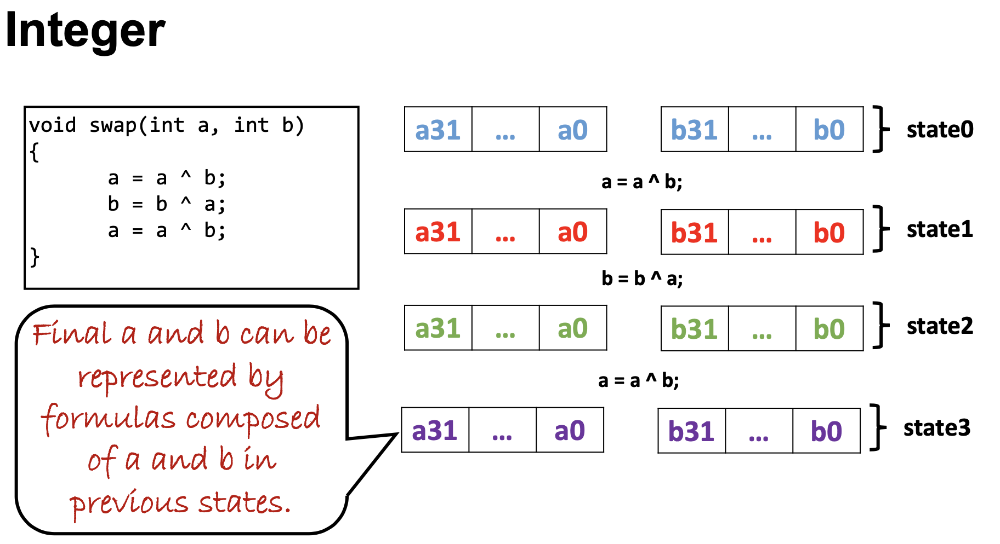
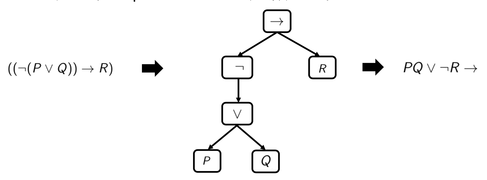
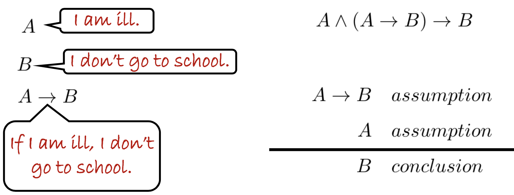
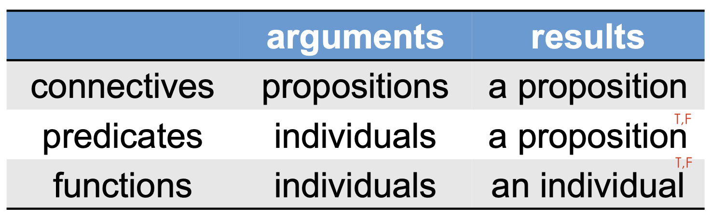
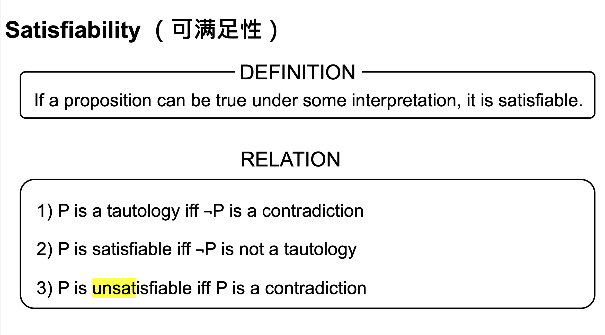
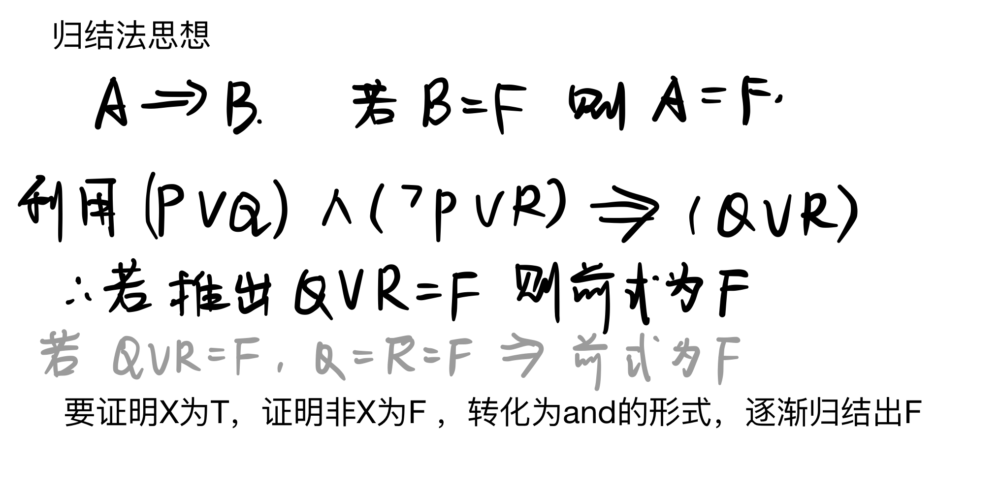
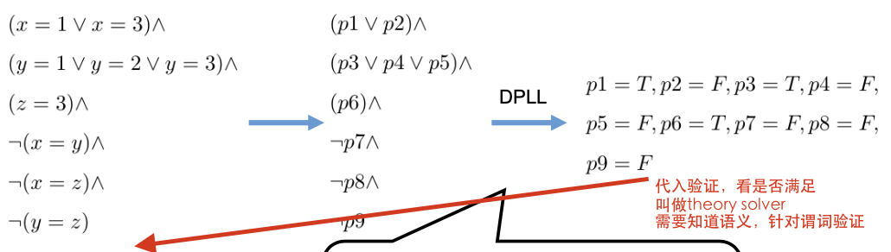

# Note of Discrete Mathematics

[TOC]

### 本课词汇

1. Propositional 命题
2. semantic 语义的
3. tautology 重言式
4. UNSAT    矛盾式

## 1. Overview

1. References

• **Stanford CS103,** **https://web.stanford.edu/class/cs103**

• **NYU G22.2390-001,** **https://cvc4.cs.stanford.edu/logic/** • CMU CDM http://www.cs.cmu.edu/~cdm/

• UB CS70 http://inst.eecs.berkeley.edu/~cs70/fa16/
 • CMU-CS122 https://www.cs.cmu.edu/~iliano/courses/17F-CMU-CS122/

• **Stanford CS103,** **https://web.stanford.edu/class/cs103**

• CMU 15-453 https://www.cs.cmu.edu/~fp/courses/flac/
 • Columbia, COMS W3261, http://www.cs.columbia.edu/~aho/cs3261/ • IITJodhpur,CS222,http://krchowdhary.com/toc/cs222.html
 • 南京大学离散数学课程


2. To Be Distinguished, You Need To

Take

- ✓  Lectures

- ✓  Recitation (Optional)

  

  Do

- ✓  3 Labs

- ✓  Preliminary Questions

- ✓  Homework

  Pass
   ✓ Quiz

  ✓ Finalexam

### Grading Breakdown

- Others 20%
- Lab 20%
- Quiz 20%
- Final 40%


### Faculty Information

**Lecturer**

Zhaoguo Wang (王肇国) zhaoguowang@sjtu.edu.cn

Zeyu Mi (糜泽羽) yzmizeyu@gmail.com

**TA**

Haoran Ding (丁浩然) nhaorand@sjtu.edu.cn

Yuqi Hu (胡雨奇) yuki.h@sjtu.edu.cn

### 网站

Website:

http://ipads.se.sjtu.edu.cn/courses/cdm

Canvas:

https://oc.sjtu.edu.cn/courses/24410

形式化验证网站：

https://rise4fun.com/Dafny/tutorial

软件大楼4号楼（ipads 实验室）门口数第二个

### Three Parts of CDM(*)

 Part I. Reasoning. (*8 ~ 9 Weeks*)

How to prove the correctness?

Part II. Computability. (*~ 6 Weeks*)
 Is the problem computable (solvable)?

Part III. Probability. (~*1 Weeks*)

How does computer solve continuous problem? (Underneath the ML)

### Textbooks

《数理逻辑与集合论》第2版 • 石纯一 著，清华大学出版社

John E. Hopcroft, Rajeev Motwani and Jeffrey D. Ullman, Introduction to Automata Theory, Languages, and Computation, Pearson, 2001

### 移位运算符

左移（<<）

i = i << n ;  相当于 i = i * (2  ^ n )

右移（>>）

i = i >> n ;  相当于 i = i / ( 2 ^ n ) 

### 位运算符  与（&）运算符  异或^

&

位操作中的与操作运算符。也就是常说的and操作，双目运算符。
计算的时候按位计算，&两边操作数对应位上全为1时，结果的该位值为1。否则该位值为0
比如0x12&0x23 转为二进制为:B00010010&B00100011，按位计算结果为B00000010，
即结果为0x02

^

两个二进制操作数对应位相同为0，不同为1;


**异或交换取值**

```C++ 
void swap(int a, int b)
{
	a ^= b;
	b ^= a; 
	a ^= b;
}
```

<u>参考：</u>

https://blog.csdn.net/mofeigege/article/details/106304076?ops_request_misc=%257B%2522request%255Fid%2522%253A%2522159995841819725222400123%2522%252C%2522scm%2522%253A%252220140713.130102334..%2522%257D&request_id=159995841819725222400123&biz_id=0&utm_medium=distribute.pc_search_result.none-task-blog-2~all~top_click~default-1-106304076.first_rank_ecpm_v3_pc_rank_v2&utm_term=位运算符&spm=1018.2118.3001.4187


https://jingyan.baidu.com/article/a3f121e4919494fc9052bb0f.html


### question

Three Parts of CDM CDM：computer Discrete Mathematics?

(Underneath the ML):Machine Learning?


**形式化验证举例：**

```C++ 
method clone(n: nat) returns (b : nat)
ensures b == n
{
var i := 0;
while i < n
invariant 0 <= i && i <= n
{
i := i + 1;
}
return i; }
```


## 2. Propositional Logic

教材《数理逻辑与集合论》1.1-1.3、1.5、2.3-2.4

### 概念：

1.  A **proof** is an argument that demonstrates why a conclusion is true, subject to certain standards of truth.

2. A **mathematical proof** is an argument that demonstrates why a <u>mathematical</u> statement is true, following the rules of mathematics. 

3. A **proposition(命题)** is a statement that is, by itself, either true or false.

   > Questions ，commands, exclamations are not propositions.
   >
   > eg.
   >
   > Tom is taller than Jerry √
   > 2 + 2= 4							√
   > N >6            					X（这个是不能判断的，没有确定N的范围）
   > Discrete mathematics is edible 3 is odd √
   >
   > 请问“这句话是错的”是命题吗？（提示：这是一个悖论）X 无法判断正误

4. **Propositional logic** (命题逻辑) is a mathematical system for reasoning about propositions and how they relate to one another.

   Every formula in propositional logic consists of **propositional variables(命题变量)** combined via **propositional connectives（命题连接词）.**

   **propositional variables(命题变量)**：simple propositions

   **Atomic Proposition (**原子命题**)**：无连接词的命题P、Q

   **propositional connectives（命题连接词）**：**NOT、 AND 、OR、Implication →、Biconditional Connective(双条件词)**

   

$$
\begin{array}{clc}
\hline P & Q & P \rightarrow Q \\
\hline \mathrm{T} & \mathrm{T} & \mathrm{T} \\
\mathrm{T} & \mathrm{F} & \mathrm{F} \\
\mathrm{F} & \mathrm{T} & \mathrm{T} \\
\mathrm{F} & \mathrm{F} & \mathrm{T} \\
\hline
\end{array}
$$

$$
\begin{array}{cccc}
\hline P & Q & P \leftrightarrow Q & (P \rightarrow Q) \wedge(Q \rightarrow P) \\
\hline \mathrm{T} & \mathrm{T} & \mathrm{T} & \mathrm{T} \\
\mathrm{T} & \mathrm{F} & \mathrm{F} & \mathrm{F} \\
\mathrm{F} & \mathrm{T} & \mathrm{F} & \mathrm{F} \\
\mathrm{F} & \mathrm{F} & \mathrm{T} & \mathrm{T} \\
\hline
\end{array}
$$

### Modern Proofs Method

Direct Proof.

Proof By Contradiction. （反证法）

Proof By Induction.(归纳法)

Case By Case（枚举）

### Well-Formed Formulas (合式公式)

**INDUCTIVE DEFINITION of WFF（循环定义）**

1). 简单命题是is WFF.
 2). If *A* and *B* are WFF, so are (¬A), (A ∧ B), (A ∨ B), (A →B), and (A ↔ B).
 3). No expression is WFF unless forced by 1) or 2).

### Completeness Of Connectives(联结词完备性)

**定义：**

任意一个联结词可以看出一个真值表对应的一个返回值为bool函数（n 元）可以转化用一组定义的联结词组合而成的函数

**表示：**

<u>方法1：</u>**1.**找到所有的 T 	 **2.** 将P或者Q使用取反，得到 T ∧ T →T	 **3.** 使用V 连接

解释，∧ 只有一种可能性是T，所以再用V并起来，就是所有的T了

PS：如果没有TorF，则构造

P ∧ $\neg P$ =F   

P V $\neg P$ =T

<u>方法2：</u> **1.**找到所有的F  **2.** 将P或者Q使用取反，得到 F ∨ F→F **3.** 使用∧ 连接

**举例：**
$$
\begin{array}{cccc}
\hline \mathrm{P} & \mathrm{Q} & g_{0}(P, Q) & g_{1}(P, Q) \\
\hline \mathrm{F} & \mathrm{F} & \mathrm{T} & \mathrm{T} \\
\mathrm{F} & \mathrm{T} & \mathrm{T} & \mathrm{T} \\
\mathrm{T} & \mathrm{F} & \mathrm{F} & \mathrm{F} \\
\mathrm{T} & \mathrm{T} & \mathrm{T} & \mathrm{F}
\end{array}
$$

$$
\begin{array}{l}
g_{0}(P, Q)=(((\neg P) \wedge(\neg Q)) \vee((\neg P) \wedge Q)) \vee(P \wedge Q) \\
g_{1}(P, Q)=((\neg P) \wedge(\neg Q)) \vee((\neg P) \wedge Q)
\end{array}
$$

$$
\begin{array}{l}
g_{0}(P, Q)=((\neg P) \vee Q)\\
g_{1}(P, Q)=((\neg P) \vee Q) \wedge((\neg P) \vee(\neg Q)) 
\end{array}
$$

例题：
$$
\begin{aligned}
&\text { 对于由 n 个命题变元构成的命题公式, 可能的真值表有（） 种。 }\\
&n\\
&2^{n}\\
&n !\\
&\bullet2^{2^{n}}
\end{aligned}
$$

$$
\begin{aligned}
&\text { 一个命题公式依赖于 n 个命题变元，那么真值表的行数是（） 。 }\\
&n !\\
&n\\
&\bullet 2^{n}
\end{aligned}
$$

### 独立完备集

最优完备集合$\neg \wedge $或者$\neg \vee$ ，因为$P\vee Q= \neg(\neg P \wedge \neg Q)$

完备集和举例：
$$
\begin{aligned}{}
&\{\neg, \vee\}，\{\neg, \wedge\}\\
&\{\neg, \rightarrow\} \quad\neg (\neg P\rightarrow Q )=\vee\\
&\{\downarrow\}(或非) A\downarrow B = \neg A \wedge \neg B \\
&\{\uparrow\}(与非) A\uparrow B = \neg A \vee \neg B \\
prove:\\

&\neg A =A\downarrow A \\
& A \vee B = \neg (\neg A \wedge \neg B ) = \neg(A\downarrow B)

\end {aligned}
$$
不完备集合举例：
$$
\{\vee, \wedge\}\{\neg, \leftrightarrow\} \quad 不可以，因为这两个的标志是FFF，TTT，都是同时成立的
$$


### 合式公式化简，运算律

1. **连接符的优先级，左结合**

$$
\neg>\wedge>\vee>\rightarrow>\leftrightarrow\\
P\rightarrow Q \rightarrow R = (P\rightarrow Q)\rightarrow R
$$

2. **Propositional Equivalences(等值)⟺**

$$
P=Q \text { or } P \Leftrightarrow Q
$$

定义：有相同的真值表

3. **Equivalence Theorem**(等值定理)**:** 𝑃 = 𝑄 iff 𝑃 ⟷ 𝑄 is always true.

4. **De Morgan‘s Laws(摩根律)**

$$
\neg(P \wedge Q)=\neg P \vee \neg Q, \neg(P \vee Q)=\neg P \wedge \neg Q
$$

5. **Double Negation**(双重否定律)**:** ¬¬𝑃 = 𝑃

6. **Associative Law**(结合律)**:** 
   $$
   \begin{array}{c}
   (P \vee Q) \vee R=P \vee(Q \vee R) \\
   (P \wedge Q) \wedge R=P \wedge(Q \wedge R) \\
   (P \leftrightarrow Q) \leftrightarrow R=P \leftrightarrow(Q \leftrightarrow R) \\
   (P \rightarrow Q) \rightarrow R \neq P \rightarrow(Q \rightarrow R)\\
   这里注意：汤姆猫的例子
   \end{array}
   $$

7. **Commutative Law**(交换律)**:**

$$
\begin{aligned}
P \vee Q &=Q \vee P \\
P \wedge Q &=Q \wedge P \\
P \leftrightarrow Q &=Q \leftrightarrow P\\
P \rightarrow Q &\neq Q \rightarrow P \\
\end{aligned}
$$

8. **Idempotent Law**(等幂率)**:**

$$
\begin{array}{l}
P \vee P=P \\
P \wedge P=P \\
P \leftrightarrow P=T \\
P \rightarrow P=T
\end{array}
$$

9. **Identity Law (同一律)：**

$$
\begin{array}{l}
P \vee F=P \\
P \wedge T=P \\
T \rightarrow P=P \\
T \leftrightarrow P=P \\
P \rightarrow F=\neg P \\
F \leftrightarrow P=\neg P
\end{array}
$$

9. **Complementary Law（补余律）：** 

$$
\begin{array}{l}
P \vee \neg P=T（*） \\
P \wedge \neg P=F （*）\\
P \rightarrow \neg P=\neg P \\
\neg P \rightarrow P=P \\
P \leftrightarrow \neg P=F
\end{array}
$$
10. **Zero Law （零律）：**

$$
\begin{array}{l}
P \vee T=T \\
P \wedge F=F \\
P \rightarrow T=T \\
F \rightarrow P=T
\end{array}
$$

11. **Distributive Law（分配律）:**

$$
\begin{array}{l}
P \vee(Q \wedge R)=(P \vee Q) \wedge(P \vee R) \\
P \wedge(Q \vee R)=(P \wedge Q) \vee(P \wedge R)
\end{array}
$$
12. **Absorption Law（吸收律）:**

$$
P \vee(P \wedge Q)=P
$$
$$
P \wedge(P \vee Q)=P
$$

13. $P \rightarrow Q = \neg P \vee Q $  

14. 异或(不可兼或)：$\overline{\text{V}}= （\neg A \wedge B ）\vee (\neg B \wedge A)$
    $$
    \begin{array}{clc}
    \hline P & Q & P\overline{\vee}Q \\
    \hline \mathrm{T} & \mathrm{T} & \mathrm{T} \\
    \mathrm{T} & \mathrm{F} & \mathrm{F} \\
    \mathrm{F} & \mathrm{T} & \mathrm{F} \\
    \mathrm{F} & \mathrm{F} & \mathrm{T} \\
    \hline
    \end{array}
    $$
    

    

    

### 真实问题的逻辑表示

**流程：**1.找到命题变量 2.写出WWF  3.化简得到答案

二皇后问题
$$
\begin{array}{|c|c|}
\hline P 1 & P 2 \\
\hline P 3 & P 4 \\
\hline
\end{array}
$$
放置条件$\wedge$ 必须放两个


证明  $P \wedge \neg P$ = F

$P\leftrightarrow F $是永真式，P是矛盾式（永假式）


### Exercise

$$
\begin{array}{c}
P \rightarrow Q=\neg Q \rightarrow \neg P \\
P \rightarrow(Q \rightarrow R)=Q \rightarrow(P \rightarrow R) \\
P \rightarrow(Q \rightarrow R)=(P \wedge Q) \rightarrow R
\end{array}
$$


Hint:$P \rightarrow Q = \neg P \vee Q $

下面联结词中哪个是不完备的 （D ）
$$
\begin{aligned}{}
&\{\neg, \vee\}\\
&\{\neg, \rightarrow\} \quad\neg (\neg P\rightarrow Q )=\vee\\
&\{\neg, \wedge\}\\
&\{\vee, \wedge\} \quad 不可以，因为这两个的标志是FFF，TTT，都是同时成立的
\end {aligned}
$$


question:区别究竟是什么？？


### 匹配问题

tom、jerry 吃鸡：T，吃milk :F ,nibble 吃鸡：true


条件：

1. Nibbles must eat chicken.P3
2. Chicken cannot be shared.

$$
\neg(P 1 \wedge P 2) \wedge  \neg(P 2 \wedge P 3) \wedge \neg(P 1 \wedge P 3) 
$$

3. Milk cannot be shared.$\neg(\neg P 1 \wedge \neg P 2)$

总结：
$$
\begin{aligned}
&P 3 \wedge \neg(P 1 \wedge P 2) \wedge  \neg(P 2 \wedge P 3) \wedge \neg(P 1 \wedge P 3) \wedge  \neg(\neg P 1 \wedge \neg P 2)

\end{aligned}
$$


证明：

1. $\neg(\neg P 1 \wedge \neg P 2) = P1 \vee P2$

2. $P3\wedge \neg(P 2 \wedge P3)=P3 \wedge(¬𝑃2∨¬𝑃3)=P3 \wedge¬𝑃2$

3. 重复2

   


### Tautology(重言式/永真式)

$$
P \vee \neg P\\
P \vee T \\
\neg(A \wedge B) \leftrightarrow(\neg A \vee \neg B)
$$

### Contradiction(矛盾式/永假式)

$$
\begin{array}{l}

P \wedge \neg T \\
P \wedge F  \\

\end{array}
\\
(P \leftrightarrow Q) \leftrightarrow((P \wedge \neg Q) \vee(Q \wedge \neg P))
$$


### Normal Form(范式)

**Conjunction Normal Form**(合取范式)

1. 去掉$\leftrightarrow 、\leftarrow、\rightarrow$
2. 去掉非
3. 使用分配率

**Disjunction Normal Form**(析取范式)

同上

**Principal Normal Form**(主范式)

每个子句p,q只能出现一次

**Principal Disjunction Normal Form**(主析取范式)

and起来条件更严格，所以叫做极小项

要构造析取子句，要and 上，并且P要and QV$\neg Q$ Q要and PV$\neg P$ 
$$
\begin{aligned}
& P \rightarrow Q \\
=& \neg P \vee Q \\
=&(\neg P \wedge(Q \vee \neg Q)) \vee Q \\
=&(\neg P \wedge Q) \vee(\neg P \wedge \neg Q) \vee Q \\
=&(\neg P \wedge Q) \vee(\neg P \wedge \neg Q) \vee(Q \wedge(P \vee \neg P)) \\
=&(\neg P \wedge Q) \vee(\neg P \wedge \neg Q) \vee(P \wedge Q) \vee(\neg P \wedge Q) \\
=&(\neg P \wedge \neg Q) \vee(\neg P \wedge Q) \vee(P \wedge Q) \\
=& m_{0} \vee m_{1} \vee m_{3}=V_{0 ; 1 ; 3}
\end{aligned}
$$


**Principal Conjunction Normal Form**(主合取范式)
$$
\begin{aligned}
& P \wedge Q \\
=&(P \vee(Q \wedge \neg Q)) \wedge(Q \vee(P \wedge \neg P)) \\
=&(P \vee Q) \wedge(P \vee \neg Q) \wedge(Q \vee P) \wedge(Q \vee \neg P) \\
=&(\neg P \vee Q) \wedge(P \vee \neg Q) \wedge(P \vee Q) \\
=& M_{1} \wedge M_{2} \wedge M_{3}=\wedge_{1 ; 2 ; 3}
\end{aligned}
$$

**由于永真式没有成假指派，所以永真式没有主合取范式。为方便起见，将其记为T即可**


### SAT Solver 

**Satisfiability** (可满足性)

在某个解释下=T 

计算机确定可满足性的两步：

Step 1. 把程序变成合式公式

Step 2. **Validate** the formula.验证合法性(WFF 判定)

Step 3. **Solve** the formula.（DPLL算法）


#### 把程序变成合式公式

1. 程序本质是一个状态的转变A0->A1，计算机看成是状态机。

```c++
void swap(bool& a, bool& b)
{a = a ^ b; b = b ^ a; a = a ^ b;
}
```


$$
\begin{array}{l}
(A 1 \leftrightarrow(A 0 \wedge \neg B 0) \vee(\neg A 0 \wedge B 0)) \wedge\quad \leftrightarrow表示等值 \\
(B 1 \leftrightarrow B 0) \wedge \\
(A 2 \leftrightarrow A 1) \wedge \\
(B 2 \leftrightarrow (A 1 \wedge \neg B 1) \vee(\neg A 1 \wedge B 1) \\
(A 3 \leftrightarrow ( A 2 \wedge \neg B 2) \vee(\neg A 2 \wedge B 2)) \wedge \\
(B 3 \leftrightarrow B 2) \rightarrow \\
(A 3 \leftrightarrow B 0) \wedge(A 0 \leftrightarrow B 3)\quad 这是要实现的内容
\end{array}
$$
2. 要证明重言式，即证明非矛盾式

3. 相同的变量直接替代



3. 条件if

   

   

**重点：**
$$
\begin{array}
& X_{3} &=(A\rightarrow X_{1})\wedge(A\rightarrow X_{2}) \\
    &=(A \wedge X 1) \vee(\neg A \wedge X 2)
\end{array}
$$



$$
\begin{array}{l}
\text{结果}：\\
X 1 \wedge \neg X 2 \wedge Y 4 \wedge \neg Y 5 \wedge \\
(X 3 \leftrightarrow((A \wedge X 1) \vee(\neg A \wedge X 2))) \wedge \\
(Y 6 \leftrightarrow((B \wedge Y 4) \vee(\neg B \wedge Y 5))) \\
\rightarrow \\
(X 3 \vee Y 6)
\end{array}
$$
A=F, B=F can satisfy it. So the assertion will fail.

4. 整数，每一位当成一个命题变量



5. **Operators**操作符

   所有操作符都可以表示为位运算，逻辑电路就是这么做的：

   Logical operators, bit operators：&,|,^,>>,!,......

   Relational operators：\、>,<,==

6. 有限循环：扒开，无限的目前在这里没有解决

   

#### WFF 的判定算法

 给定一个表达式，首先要判定这个式子是否有意义才能开始求解，也就是判定它是否是

一个合式公式(WFF)。合式公式的定义如下:

1. 原子命题是合式公式。
2. 如果 A 和 B 是合式公式，那么 (¬A), (A ∨ B), (A ∧ B), (A → B), (A ↔ B) 都是合式 公式。
3. 当且仅当通过上面两个规则构造的表达式才是合式公式。

这里的定义和课本上的定义在括号的使用上略有不同，但是本质是一样的。 下面介绍自动判定一个表达式是否是合式公式的一个算法。这个算法严格按照上面的 定义进行判定，不允许多加括号或者少加括号。输入是一个表达式 P，输出 true 或者 false。

1. 首先构建一棵树，只有一个节点，节点里面是 P。
2. 如果树的所有节点都是原子命题，那么返回 true。
3. 选择一个叶子节点，节点放的不是一个原子命题，是一个表达式 f。
4. 如果 f 开头不是左括号或者结尾不是右括号，那么返回 false。
5. 如果 f=(¬Q)，那么给 f 所在的叶节点新加一个子节点，存放 Q。转步骤 2
6. 现在令 f=(F)，从左到右扫描 F，直到找到第一个非空表达式 A，使得 A 的左括号数 量和右括号数量相等。如果找不到这样的 A，那么返回 false。
7. 如果 f=(A ⊙ B), ⊙ ∈ {→, ↔, ∨, ∧}，那么给 f 所在的叶子节点新加两个子节点，一个 存放 A，一个存放 B。转步骤 2。
8. 返回 false


#### DPLL算法(求可满足的解释)(肯定会考！！)

核心：减少搜索空间


1. 尝试失败->剪枝->回溯
2. 通过规则进行推导，不用猜了
3. 单个的先赋值为T

**使用CNF不用DNF的原因：**

1. 有开关变量，转化为DNF 之后不成为爆炸（变成3+3），减少了变量，转化的复杂度是多项式复杂度，没有开关变量无论是CNF还是DNF都是指数的

2. 引入的Z 的式子的语意上不一样的，但是可满足性是一样的。

3. $$
   \begin{array}{l}
   (Z \rightarrow A 1 \wedge A 2 \wedge A 3) \wedge 
   (\neg Z \rightarrow B 1 \wedge B 2 \wedge B 3)
   \end{array}
   $$


1. **Decide Rule**

如果我们从未认定过某个 literal 的真值，那么这个 literal 就叫做 undefined literal。 Decide rule 是说，选取一个 undefined literal，猜测它的真值，并标记这个 literal 为 decision literal。例如对于 A ∨ ¬B, B ∨ ¬C, C ∨ A，可以按照 decide rule 猜测 A 的真值为 F，并标 记 A 为 decision literal。注意，这里如果先选择 B 或者 C 猜测真值也是可以的，另外先猜 测 A 的真值是 T 也是可以的。

2. **Unitpropagate Rule**

某个 literal 有了真值后，就可以推导出其它一部分 literal 的真值。按照 unitpropagate rule，A ∨ ¬B, B ∨ ¬C, C ∨ A 中 A 的真值是 F，那么可以推导出 B 的真值是 F，因为当且 仅当 B 的真值是 F 的时候 A ∨ ¬B 的真值才能是 T，整个 CNF 公式的真值才有可能是 T。 接着可以发现，我们还可以推导出 C 的真值是 F，因为当前情况下当且仅当 C 的真值是 F 的时候 B ∨ ¬C 的真值才能是 T，整个 CNF 公式的真值才有可能是 T。

3.  **Backtrack Rule**

Backtrack rule 是说如果发现当前 CNF 的某个子句真值是 F，也就是说整个 CNF 的真 值已经是 F 的时候，说明对某个 literal 的赋值错了，要进行回溯，找到最近的一个 decision literal 重新赋值，这个真值为 F 的子句称为 conflicting clause。在这个例子中，A 的真值是 F，B 的真值是 F，C 的真值是 F，发现子句 C ∨ A 真值是 F，进行回溯，目前最近的一个 decision literal 是 A，A 一开始猜测的真值是 F，按照 backtrack rule，重新猜测 A 的真值 是 T，并标记 A 为 non-decision literal，表明 A 的两种真值都考虑过了。由于 B 和 C 的 真值都是在猜测 A 真值为 F 的前提下推导出来的，所以现在 B 和 C 的真值无效了，要重 新按照 DPLL 的这些规则推导。

4.  **Fail Rule**

在上面的例子中，由于找到 A 是 decision literal，所以才能使用 backtrack rule 进行回 溯。Fail rule 是说如果出现了 conflicting clause 但是又找不到 decision literal，说明这个公 式是不可满足的，直接输出 unsat。

5.  **Pureliteral Rule**

仔细观察例子 A ∨ ¬B, B ∨ ¬C, C ∨ A，我们发现其中只有 A 没有 ¬A，那么我们可以 直接认为 A 的真值是 T，因为 A 是 T 的话那所有包含 A 的子句的真值就都是 T 了，如 果在 A 真值是 T 的情况下公式真值还是 F，那么即使把 A 的真值改成 F 公式的真值也还 是 F。

考试写算法，要把后面的XXrules （可以缩写Unit、 Pure）写一下


### （Reverse） Polish notation(（逆）波兰表达式)


**Reverse polish notation**(逆波兰表达式)

后序遍历




## 3.Deduction 推理

推理形式：



重言蕴涵：$A \Rightarrow B$

若存在一些命题变量，使得A为T 的情况B一定是T，$A \rightarrow B$为永真，$A \Rightarrow B$为命题表达式（非命题）

1) If 𝐴 ⟹ 𝐵, 𝐴 is a tautology, then 𝐵 is a tautology.

2) If 𝐴 ⟹ 𝐵, 𝐵 ⟹ 𝐴, then 𝐴 = 𝐵.

3) If 𝐴 ⟹ 𝐵, 𝐵 ⟹ 𝐶, then 𝐴 ⟹ 𝐶.

4) If 𝐴 ⟹ 𝐵, 𝐴 ⟹ 𝐶, then 𝐴 ⟹ 𝐵 ∧ 𝐶. 

5) If 𝐴 ⟹ 𝐶, 𝐵 ⟹ 𝐶, then 𝐴 ∨ 𝐵 ⟹ 𝐶.

### 推理规则

1. $\neg(P \rightarrow Q) \Rightarrow P$
   $\neg(P \rightarrow Q) \Rightarrow \neg Q$
2. 分离规则/假言推理hypothetical reasoning：$P \wedge(P \rightarrow Q) \Rightarrow Q$
3. 三段论Syllogism:$(P \rightarrow Q) \wedge(Q \rightarrow R) \Rightarrow P \rightarrow R$
4. 前提引入规则:assumptions/premise
5. 代入规则Substitution rule:对于永真式可以进行任意的替换
6. 置换规则Replacement rules: 表达式可以替换成等价的表达式（真值表相同)
7. 条件证明规则:𝑨 ∧ 𝑩 ⟹ 𝑪 𝒊𝒇𝒇 𝑨 ⟹ 𝑩 → 𝑪.


### Resolution Reasoning(归结推理法)

Because𝑨⟹𝑩iff𝑨∧¬𝑩 isa contradiction. We can prove 𝑨 ∧ ¬𝑩 is a contradiction.


## 4.谓词逻辑

引入这个可以解决整数一位一位的繁杂情况。

### 概念

1. **individuals : 个体词**

2. **discourse : 论域** The range of individuals is domain of discourse(论域).

3. **Predicate：谓词**

   def:Predicates describe properties of individuals(个体词)

   1. 谓词有点像形容词，描述了某个性质，用大写字母表示 eg. STRONGER（Tom, Jerry）

   2. P(X1,X2,...,Xn) n-ary predicate ，P 没有具体所指(个体是变xiang)，P是**谓词变项**，所以无法判断FT，X1-Xn是**个体变项**，当X1-Xn有具体所指的时候，变成**命题**，可以判断。

      **注意：**STRONGER(TOM，JERRY)，STRONGER is a predicate constant.(谓词常项),Tom and Jerry are

      individual constants.(个体常项)

   4. 7=5 "="也是一个特殊的谓词常项

4. **Funcftion : 函数**

   输入&输出： **都是个体词**，表示个体词到个体词的映射关系 bestfriend(Bob)=Alice

    bestfriend(Bob) 不是命题，但是 bestfriend(Bob)=Alice是命题，=是谓词

   

5. **量词：**

   1. **The Universal Quantifier(全称量词)：**任意

      (∀ x)(f(x))   x:**约束变元**

      当论域为空时，(∀ x)(f(x))  = T

   2. **The Existential Quantifier(存在量词)：**

      (∃x)(f(x)) 

      当论域为空时，(∃ x)(f(x))  =F

   3. (∀ x)F(x)VQ (x)  ，F(x)是x的**辖域**，F（x）中的x 是约束变元，Q（x）中 的x是**自由变元。**

   4. 限制自由变元的方法：

      1. 变成constants
      2. 增加量词

   5. (∀/∃ x)(∀/∃ y)P(x,y) = (∀/∃ x)( (∀/∃ y)P(x,y) )

   6. (∀ x)f(x) =f(1)$\wedge$ f(2)$\wedge$ ...(都满足)

      (∃ x)f(x) =f(1)$\vee$ f(2)$\vee$ ...（只要一个满足）

      论域为{1，2}

      - (∃ x) (∀ y)f(x,y) =(P(1,1)$\wedge$P(1,2))V((P(2,1)$\wedge$P(2,2))
      - (∀ x) (∃ y)f(x,y) =(P(1,1)VP(1,2))$\wedge$((P(2,1)VP(2,2))
      - 不可交换
      - (∃ x) (∀ y)f(x,y)  推出(∀ x) (∃ y)f(x,y) ，不可反推。语义上理解。（PPT有推导）

   ### 命题逻辑是特殊的谓词逻辑

   - 命题逻辑可以看作是零阶逻辑，P Q 可以看成是0元谓词。

   - 命题逻辑是一种比较简单，泛泛的逻辑。比如令命题A表示“小明喜欢数学”。

   - 而谓词逻辑，**是将命题逻辑表达不出来的逻辑继续细化**，比如A（x,y）表示x喜欢y，则“小明喜欢数学”可以表示为A（小明，数学）

   <u>命题只能表示F。T 是bit，要把一个事物拆分，然后判断每一个部分的真值。</u>

   <u>然而谓词引入了个体词，类型之间的关系，而且引入了函数，可以把谓词相互转化，加强了阐述能力。</u>


### Well-formed Formula(合式公式)

1.  **Terms**are expressions generated from the individuals by the functions.

2. An **atomic formula**(原子谓词公式) 参数都是term

**INDUCTIVE DEFINITION of WFF**

1). Every atomic formula is in WFF.

2). If A and B are WFFs, so are ¬A , (A ∧ B), (A ∨ B), (A → B), and (A ↔ B). And there is no variable **which is bounded in one wff and free in the other wff.**

3). If A is a WFF and x is free in A, then **（∀x） A, （∃x） A** are wffs.

 4). No expression is WFF unless forced by 1), 2) or 3).


### 自然语句的形式化

1. 所有的有理数都是实数

   (∀ x) （P（x）->Q(x)）


### Validity(有效性)

interpretation(解释) ：解释即为对于变项的赋值，P(X) = STRONG(x),更像是赋了一个语义

**valid ：**If a formula is always true under any interpretations, it is universally valid $($ 普遍有效 $) .(\forall x)(P(x) \vee \neg P(x))$

**satisfiable：**If a formula is true under some interpretation, it is satisfiable (可满足）$(\forall x)(P(x)$ 

当解释P（x）为 X>0

**unsatisfiable：**If a formula is always false under any interpretations, it is unsatisfiable
(不可满足的 $) .(\forall x)(P(x) \wedge \neg P(x))$




**1) P is universally valid iff ¬P is unsatisfiable**

**2) P is satisfiable iff ¬P is not universally valid**

<u>**注意：P可满足的反面是：非P不是永真**</u>

### Decision Problem(判定问题)

- Predicate logic is not decidable
- Predicate logic with finite domain is decidable
- Formula with only unary predicate variable is decidable
- 命题逻辑是可判定的（真值表）
- The following forms are decidable

$$
\begin{array}{l}
\left(\forall x_{1}\right) \ldots\left(\forall x_{n}\right) P\left(x_{1}, \ldots, x_{n}\right) \\
\left(\exists x_{1}\right) \ldots\left(\exists x_{n}\right) P\left(x_{1}, \ldots, x_{n}\right)
\end{array}
$$

### Deduction Formula(推理公式)

举例：反推P（x）和Q（x）中的x 不一定是同一个x


**全称量词引入规则**

(1)$P(x)$
(2)$(\forall x）P(x) $

<u>条件：如果x 在P中都是自由变元（这样才能说明任意性），就可以引入任意</u>

**存在量词引入规则**

(1)$P(c)$
(2)$(\exists x）P(x) $

$P(c) \Rightarrow(\exists x) P(x)$

c是一个个体常项，对于一个常项成立，那么对于变项一定有一个是成立的

<u>条件：需要限制 x 不出现在P(c)中</u>  虽然给出了反例，但是怎么去理解呢？

**任意量词消去原则**

$(\forall x) P(x) \Rightarrow P(y)$或者 $(\forall x) P(x) \Rightarrow P(c)$

<u>条件：y不可以在P(x)的约束(任意存在)中出现</u>，虽然给出了反例，但是怎么去理解呢？

**存在量词消去规则**

$(\exists x) P(x) \Rightarrow P(c)$

c是一个个体常项

<u>条件：</u>

1.  <u>  **$(\exists x) P(x)$ 中没有自由变量的出现**，比如对于任意的y,确实会存在x满足某条性质，但是这个x的范围是y 的函数，这样就推不出一个固定的c 了</u>

2. <u>**P(x)里面不能含有c**,如果含有c,和上面一样，确实会存在x满足某条性质，但是这个x的范围是c 的函数，这样就推不出一个固定的c</u> 


### Resolution Reasoning(归结推理法)

原理：(𝑷∨𝑸)∧(¬𝑷∨𝑹) ⟹𝑸∨𝐑



### Prenex Normal Form(前束范式)

任意的一个式子可以转换成前束范式

#### Equivalence(等值)

1. 每次穿过量词，存在任意变化

$$
\begin{array}{l}
\neg(\forall x) P(x)=(\exists x) \neg P(x) \\
\neg(\exists x) P(x)=(\forall x) \neg P(x)
\end{array}
$$

2. Distributive Law(分配律):

$$
\begin{array}{l}
(\forall x)(P(x) \vee q)=(\forall x) P(x) \vee q \\
(\exists x)(P(x) \vee q)=(\exists x) P(x) \vee q \\
(\forall x)(P(x) \wedge q)=(\forall x) P(x) \wedge q \\
(\exists x)(P(x) \wedge q)=(\exists x) P(x) \wedge q
\end{array}
$$


PS：q 可以用$(\forall y) P(y)$或者$(\exists y) P(y)$替换
$$
\begin{array}{l}
(\forall x)(P(x) \wedge Q(x))=(\forall x) P(x) \wedge(\forall x) Q(x) \\
(\exists x)(P(x) \vee Q(x))=(\exists x) P(x) \vee(\exists x) Q(x)
\end{array}
$$

$$
\begin{array}{l}
(\forall x)(P(x) \vee Q(x)) \Leftarrow (\forall x) P(x) \vee(\forall x) Q(x) \\
(\exists x)(P(x) \wedge Q(x)) \Rightarrow(\exists x) P(x) \wedge(\exists x) Q(x)
\end{array}
$$


$$
\begin{array}{l}
(\forall x)(\forall y)(P(x) \vee Q(y))=(\forall x) P(x) \vee(\forall x) Q(x) \\
(\exists x)(\exists y)(P(x) \wedge Q(y))=(\exists x) P(x) \wedge(\exists x) Q(x)
\end{array}
$$

$$
\begin{aligned}
proof\quad
&(\forall x) P(x) \vee(\forall x) Q(x) \\
=&(\forall x) P(x) \vee(\forall y) Q(y) \\
=&(\forall x)(P(x) \vee(\forall y) Q(y)) \\
=&(\forall x)(\forall y)(P(x) \vee Q(y))
\end{aligned}
$$


### Skolem Normal Form(Skolem标准形)

可满足性等价：开关变量、归结、Skolem 标准型（思考）
$$
\begin{array}{l}
(Z \rightarrow A 1 \wedge A 2 \wedge A 3) \wedge 
(\neg Z \rightarrow B 1 \wedge B 2 \wedge B 3)
\end{array}
$$


### SMT Slover()

检验是否存在一组解释，使得当前的谓词逻辑为T。

**Eager SMT**

基于SAT求解谓词逻辑

$$
y=f(z) \wedge x=f(f(z)) \wedge \neg(x=f(y))
$$
注意：=的优先级比and 高
$$
\begin{array}{l}
每个函数替换都要加这三个，如果有f，g,要写6个式子\\
\left((y \leftrightarrow z) \rightarrow\left(f_{y} \leftrightarrow f_{z}\right)\right) \wedge \\
\left(\left(y \leftrightarrow f_{z}\right) \rightarrow\left(f_{y} \leftrightarrow f_{f z}\right) \wedge\right. \\
\left(\left(z \leftrightarrow f_{z}\right) \rightarrow\left(f_{z} \leftrightarrow f_{f z}\right)\right) \wedge \\

\left(y \leftrightarrow f_{z}\right) \wedge \\
\left(x \leftrightarrow f_{f z}\right) \wedge \\
\neg\left(x \leftrightarrow f_{y}\right)
\end{array}
$$
**Lazy SMT**

<u>步骤：</u>

1. 将原子命题公式转化成命题变量
2. 放进SAT-Slover进行使用DPLL求解
3. 过程中调用T-solver进行验证，即时回溯
4. 得到结论





## question

WWF 的两条规则

2). If A and B are WFFs, so are ¬A , (A ∧ B), (A ∨ B), (A → B), and (A ↔ B). And there is no variable **which is bounded in one wff and free in the other wff.**

3). If A is a WFF and x is free in A, then **（∀x） A, （∃x） A** are wffs.

是不是因为 放入之后，必须是一个单元？替换为y 


手动推理做一遍书上的习题。


真值表按照一行来算013（看一下）

极大项只有一个F？


## 难题

永真属于可满足？是的

***


永真式不存在主合区范式。

---

即为变量的个数

---

如何证明？


---

 求范式，不唯一：列写真值表，利用短路求值快速判断。

---

求主析取范式，利用短路求值快速写出真值表，从T列些得到，求主合取范式，从F 列写得到。

---

见归结证明法。

---

 

－A VB 可满足 ，则－A或者B可满足
－*BV *A   可满足则－*B或者 *A可满足
－*B与**B同可满足
*A与-A同可满足
所以上面的可以推出下面

---


---

不用V？原因是？

---

$(\forall x) P(x) \rightarrow P(y)$
上面这个公式是可渭足的。
A True
B Fase

key：True  这个是普遍成立的，重要的是对于$(\forall x) P(x)$ 的理解，这里是只要一个是F ，那么整个就是F，所以只有 全维T，整个才是T，自然T推出T

---

