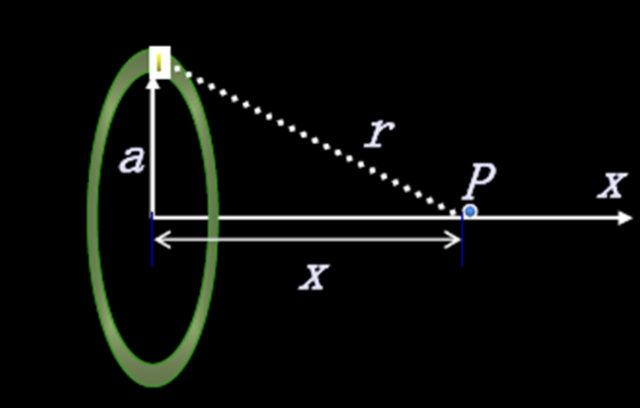
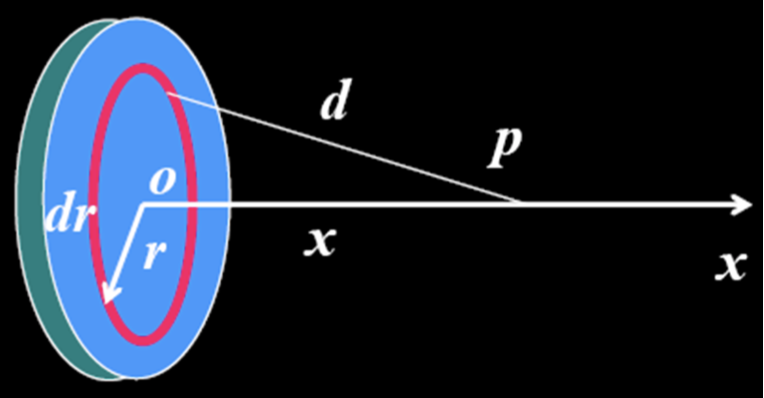
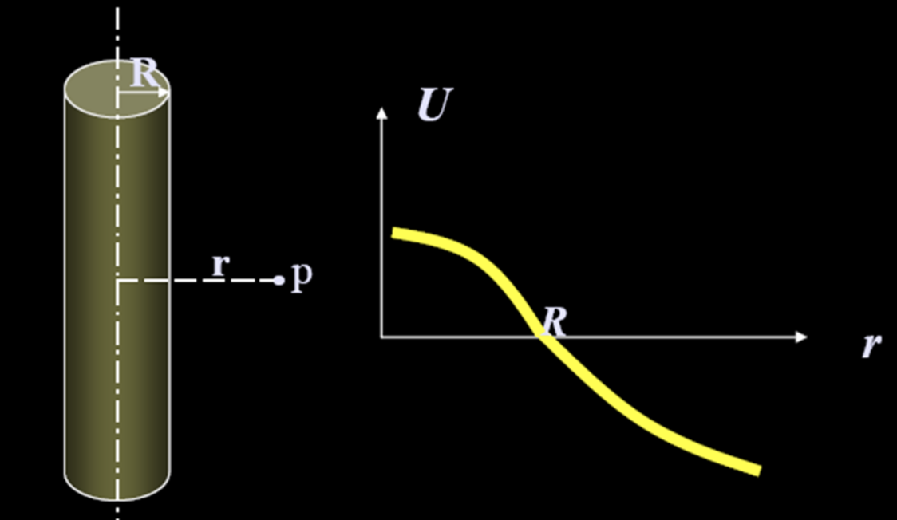
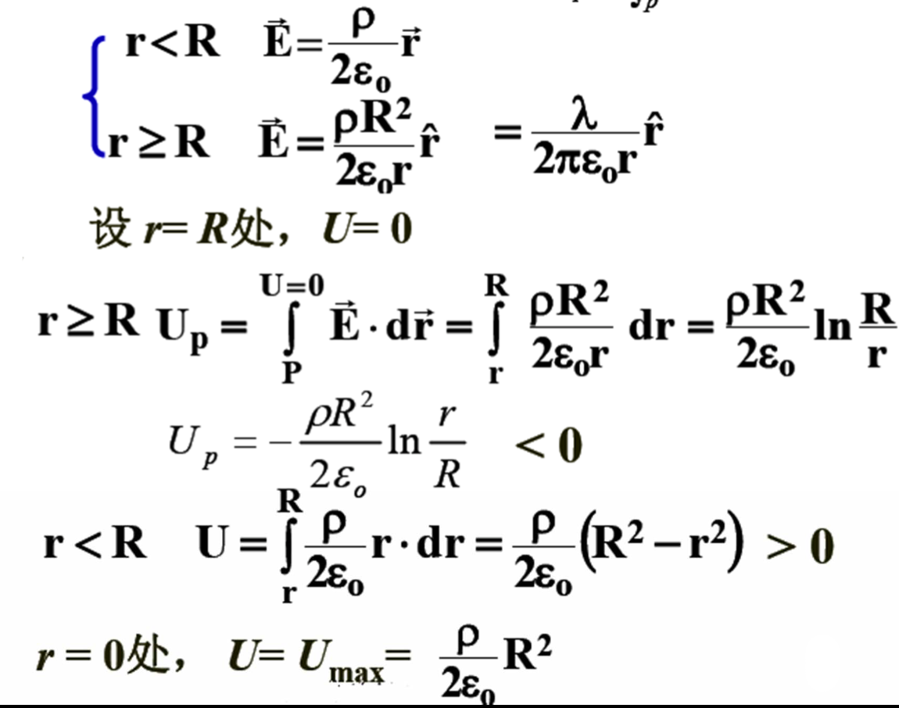

# 大学物理笔记

[TOC]

## ch1静电场

### 概念：

1. 相对于观察者静止的电荷产生的电场-静电场

2. 试验电荷**q0**:
    (**1**)正电荷 (**2**)点电荷 (**3**)电量足够小
3. 

### 库仑定律

$$
\vec{F}=\frac{1}{4 \pi \varepsilon_{0}} \frac{q_{1} q_{2}}{r^{2}} \vec{e}_{r}=\frac{1}{4 \pi \varepsilon_{0}} \frac{q_{1} q_{2}}{r^{3}} \vec{r}
$$

$\varepsilon_{0}$称为真空中的介电常数，又称为真空电容率。

适用条件：源电荷静止
$$
\varepsilon_{0}=\mathbf{8 . 8 5} \times 10^{-12} \quad\left(\mathrm{C}^{2} \cdot \mathrm{N}^{-1} \cdot \mathrm{m}^{-2}\right) \quad\\
k=\frac{1}{4 \pi \varepsilon_{0}} \approx 9 \times 10^{9}\left(N \cdot m^{2} / C^{2}\right)
$$

### 电场强度

实验: 

1、在电场的不同点上放同样的试验电荷q~0~  ，电场中各处的力学性质不同。
2、在电场的同一点上放 不同的试验电荷
$$
\frac{\vec{F}}{q_{0}} \text { 与 } q_{0} \text { 无关。 }
\\
\vec{E} \equiv \frac{\vec{F}}{q_{0}}  \quad \text { 简称场强 }
$$

$$
\begin{aligned}\text { 单位: }
N / C\quad \text { 或 } \quad V / m
\end{aligned}
$$

**点电荷的场强**
$$
\begin{aligned}
&\vec{F}=\frac{q q_{0}}{4 \pi \varepsilon_{0} r^{2}} \vec{e}_{r} \quad \vec{E}=\frac{q}{4 \pi \varepsilon_{0} r^{2}} \vec{e}_{r}
\end{aligned}
$$
**点电荷系的场强**
$$
\vec{E}=\sum \frac{q_{i}}{4 \pi \varepsilon_{0} r_{i}^{2}} \vec{e}_{r i}
$$

### 电偶极子

电偶极子: 大小相等，符号相反并有一微小间距 的两个点电荷构成的复合体。
电偶极矩:
$$
\vec{p}=q \vec{l}
$$

### 连续带电体

1. 无限长带电直线: 

$$
\begin{aligned}
\theta_{1}&=0, \quad \theta_{2}=\pi
\\
E_{x}&=0 \quad E=E_{y}=\frac{\lambda}{2 \pi \varepsilon_{0} a}  \quad \text { 只与直线的距离有关 }
\\
\end{aligned}
$$

2. 半无限长带电直线:

$$
\begin{aligned}

\theta_{1}&=\mathbf{0}, \quad \theta_{2}=\pi / 2 \\\boldsymbol{E}_{x}&=\boldsymbol{E}_{y}=\frac{\lambda}{\mathbf{4} \pi \varepsilon_{o} \boldsymbol{a}}
\end{aligned}
$$

3. 圆环：电荷**q**均匀地分布在一半径为**R**的圆环上。计算在圆环的轴线上任一给定点**P**的场强。

$$
\begin{array}{l}
E=E_{/ / x}=\int_{L} d E_{/ / x}=\int_{L} d E \cos \theta=\int_{L} \frac{x}{r} \cdot d E \\
E=\int_{0}^{2 \pi R} \frac{q x d l}{8 \pi^{2} \varepsilon_{o} R r^{3}} \mid=\frac{q x}{4 \pi \varepsilon_{o}\left(x^{2}+R^{2}\right)^{3 / 2}}
\end{array}
$$

4. 均匀带电的薄圆盘
   $$
   \begin{aligned}
   d q &=\sigma \cdot d S=\sigma \cdot 2 \pi \rho d \rho \\
     \quad dE&=\frac{d q \cdot x}{4 \pi \varepsilon_{0}\left(x^{2}+\rho^{2}\right)^{\frac{3}{2}}} \\
   E &=\int dE=\frac{\sigma}{2 \varepsilon_{0}}\left(1-\frac{x}{\sqrt{x^{2}+R^{2}}}\right).
   \end{aligned}
   $$

### 电通量

1.**均匀电场**
$$
\Phi_{e}=E S \cos \theta=\vec{E} \cdot \vec{S}
$$

2.**非均匀电场**
$$
\Phi_{e}=\int_{S} E \cos \theta d S=\int_{S} \vec{E} \cdot d \vec{S}
$$
规定闭合曲面以外法线方向为正，穿出为正，穿入为负，相切为0

3.**通过闭合曲面的电通量**
$$
\Phi=\oint_{S} \vec{E} \cdot \mathrm{d} \vec{S}
$$
规定闭合曲面法线方向向外为正！!

### **高斯定理**

$$
\Phi_{e}=\oint_{S} \vec{E} \cdot d \vec{S}=\frac{1}{\varepsilon_{o}} \sum_{i=1}^{n} q_{i \text { 内 }}=\frac{1}{\varepsilon_{0}} \int_{V} \rho d V
$$

微分形式:

$$
由高斯公式: \quad \oint_{S} \vec{E} \cdot \mathrm{d} \vec{S}=\int_{V}(\nabla \cdot \vec{E}) \mathrm{d} V
$$

$$
推出\quad \nabla \cdot \vec{E}=\frac{1}{\varepsilon_{0}} \rho  \quad 注意看看量纲
$$

$$
推导过程：\quad
\begin{aligned}
&\text { 利用数学定理 } \quad \oint_{S} \vec{E} \cdot \mathrm{d} \vec{S}=\iiint_{S \text { 内 }} \nabla \cdot \vec{E} \mathrm{d} V\\

&推出：\quad\frac{1}{\varepsilon_{0}} \iiint_{S 人} \rho \mathrm{d} V=\iiint_{S \text { 内 }} \nabla \cdot \vec{E} \mathrm{d} V \\
& 推出：\quad \nabla \cdot \vec{E}=\frac{\rho}{\varepsilon_{0}}

\\
&\text { 式中 } \quad \nabla=\hat{i} \frac{\partial}{\partial x}+\hat{j} \frac{\partial}{\partial y}+\hat{k} \frac{\partial}{\partial z} \text { 为梯度算子。 }\\
&\nabla \cdot \vec{E}=\frac{\partial E_{x}}{\partial x}+\frac{\partial E_{y}}{\partial y}+\frac{\partial E_{z}}{\partial z} \quad \text { 称为电场强度的散度。 }\\
&\text { 矢量场散度不为零时，称为有源场。 }
\end{aligned}
$$

**均匀带电球体**
$$
\begin{aligned}
&\mathbf{r} \geq \mathbf{R}:\quad  \vec{E}=\frac{q}{4 \pi \varepsilon_{0} r^{3}} \vec{r}=\frac{\rho R^{3}}{3 \varepsilon_{0} r^{3}} \vec{r}\\
&\mathbf{r}<\mathbf{R}: \quad E=\frac{\rho r}{3 \varepsilon_{o}} \quad \vec{E}=\frac{\rho}{3 \varepsilon_{0}} \vec{r}
\end{aligned}
$$

若为带电球面，内部E=0,面电荷分布处，电场强度突变

> 联想万有引力
> $$
> \begin{aligned}{}
> \Delta S_{2}\ \alpha\ r_{2}^{2}\quad  \quad\Delta S_{1}\ \alpha\ r_{1}^{2} \\
> \therefore \frac{G M_{0} \Delta S_{2} \sigma}{r_{2}^{2}}=\frac{G M_{0} \Delta S_{1} \sigma}{r_{1}^{2}}
> \end{aligned}
> $$
> 
>
> 

**无限长带电直线**
$$
\begin{aligned}
\oint_{S} \vec{E} \cdot d \vec{S}=\Phi_{1}+\int_{S_{2}} E d S+\Phi_{3}\\
\Phi_{1}=\Phi_{3}=0\\
\int_{S_{2}} E \cdot d S=E \cdot 2 \pi r h\\
E \cdot 2 \pi r h=\frac{\lambda h}{\varepsilon_{o}} \quad E=\frac{\lambda}{2 \pi \varepsilon_{o} r} 
\end{aligned}
$$

**无限大均匀带电平面**

(1)沿平面方向的平移对称性，即离开平面相同距离的地方场强大小相等; E(a)=const

(2)对平面的反演对称性，即平面前后相同距离的地方场强大小相等; E(a)=E(-a)

(3)电场方向沿垂直于平板平面方向。
$$
\begin{array}{l}
\oint_{S} \vec{E} \cdot \mathrm{d} \vec{S}=\frac{\sigma \Delta S}{\varepsilon_{0}} \\
\oint_{S} \vec{E} \cdot \mathrm{d} \vec{S}=2 \Phi_{\text {底面 }}+\Phi_{\text {侧面 }} \\
\Phi_{\text {底面 }}=E(a) \Delta S, \Phi_{\text {侧面 }}=0 \\
2 E(a) \Delta S=\frac{\sigma \Delta S}{\varepsilon_{0}}\\
\end{array}
$$

$$
\quad E=\frac{\sigma}{2 \varepsilon_{o}}
$$

**平行板电容器**

板有厚度

 **利用高斯定理计算场强的一般步骤:**

1. 对称性的分析
2. 取合适的高斯面(闭合曲面)
3. 由定义式计算电通量
4. 利用高斯定理解出 E 

**高斯面的选取:**

1. 球对称电荷: 如:均匀带电球面、体、壳等 选同心**球面**
2. 轴对称电荷: 如:均匀带电的长直线、长圆柱面(体)、长圆
    筒等选**同轴**封闭**圆柱面** (此时侧面对e有贡献) 
3. 无限大平面(板)电荷:
     垂直的**封闭(圆)柱面 (**此时底面对e有贡献)

高斯面的选取:

**补偿法例题：**

平半径为R、电荷密度为p的均匀带电球内 有一半径为r的空腔，证明空腔内为均匀电场。

实心小球在空腔产生的场:
$$
\overrightarrow{\mathbf{E}}^{\prime \prime}=-\frac{\rho}{3 \varepsilon_{0}} \overrightarrow{\mathbf{r}}^{\prime \prime}
$$
P点的合场强:
$$
\begin{array}{c}
\overrightarrow{\mathbf{E}}=\overrightarrow{\mathbf{E}}^{\prime}+\overrightarrow{\mathbf{E}}^{\prime \prime}=\frac{\rho}{3 \varepsilon_{0}} \overrightarrow{\mathbf{r}}^{\prime}-\frac{\rho}{3 \varepsilon_{0}} \overrightarrow{\mathbf{r}}^{\prime \prime} \\
\overrightarrow{\mathbf{r}}^{\prime}-\overrightarrow{\mathbf{r}}^{\prime \prime}=\overrightarrow{\mathbf{o} \mathbf{0}}^{\prime}=\frac{\rho}{3 \varepsilon_{0}}\left(\overrightarrow{\mathbf{r}}^{\prime}-\overrightarrow{\mathbf{r}}^{\prime \prime}\right) \\
\therefore \overrightarrow{\mathbf{E}}=\frac{\rho}{3 \varepsilon_{0}} \overline{\mathbf{0} 0}^{\prime}
\end{array}
$$
即腔内为均匀电场！

### 环流定理与电势

1. 点电荷的静电场

   **点电荷场力作功与具体路径无关!**
   $$
   \begin{aligned}{l}
   d A=q_{o} \vec{E} \cdot d \vec{l}&=q_{o} E \cos \theta d l\\
   E&=\frac{q}{4 \pi \varepsilon_{o} r^{2}} \\
   d A=\frac{q_{o} q}{4 \pi \varepsilon_{r} r^{2}} \cos \theta d l&=\frac{q_{o} q}{4 \pi \varepsilon_{o} r^{2}} d r \\
   A_{a b}=\int_{r_{a}}^{r_{b}} \frac{q_{o} q}{4 \pi \varepsilon_{o} r^{2}} d r&=\frac{q_{o} q}{4 \pi \varepsilon_{o}}\left(\frac{1}{r_{a}}-\frac{1}{r_{b}}\right)
   \end{aligned}
   $$

2. 一般电荷分布的静电场(点电荷系或电荷连续分布)
$$
A_{a b}=\int_{a}^{b}\left(q_{0} \vec{E}\right) \cdot \mathrm{d} \vec{l}=\int_{a}^{b}\left(q_{0} \sum_{i} \vec{E}_{i}\right) \cdot \mathrm{d} \vec{l}=\sum_{i} \int_{a}^{b}\left(q_{0} \vec{E}_{i}\right) \cdot \mathrm{d} \vec{l}
$$
​		因 $\int_{a}^{b}\left(q_{0} \vec{E}_{i}\right) \cdot \mathrm{d} \vec{l}$ 与路径无关，则 $A_{a b}$ 与路径无关！

**结论**

1. 试验电荷在静电场中移动时，电场力所作的功只与 试验电荷的起点和终点的位置有关，而与路径无关。 

   **即静电场力是保守力，静电场是保守力场。**
   保守力作功的特点(路径闭合):

2. 静电场的环流为0
   $$
   A=\oint_{l} q_{o} \vec{E} \cdot d \vec{l}=0
   $$

### 电势能与电势

$$
\begin{aligned}
-\left(W_{b}-W_{a}\right)&=\int_{(a)}^{(b)}\left(q_{0} \vec{E}\right) \cdot \overrightarrow{\mathrm{d}} \vec{l}
\\
\int_{(a)}^{(b)} \vec{E} \cdot \mathrm{d} \vec{l}&=-\left(\frac{W_{b}}{q_{0}}-\frac{W_{a}}{q_{0}}\right)
\\
\text { 电势 } \quad V&=\frac{W}{q_{0}}\\
V&=J/C\\

\int_{(a)}^{(b)} \vec{E} \cdot \mathrm{d} \vec{l}&=-\left(V_{b}-V_{a}\right)
\end{aligned}
$$

#### 零势能点的选择 

（1）在理论计算时，对有限带电体电势选无限远为 参考点;
$$
V_{\infty}=0 \quad V_{P}=\int_{P}^{\infty} \vec{E} \cdot d \vec{l}
$$
（2）如果是无限大（长）带电体，一般选取表面为零势能点，否则空间的电势会变成无限大。

（3）实际应用，选择大地，外壳为零势能点。

#### 电势的计算

电势计算的两种方法：:
一.已知场强分布, 由电势的定义计算:
$$
V_{P}=\int_{P}^{P_{0}} \vec{E} \cdot d \vec{l} \quad \quad d V=-\vec{E} \cdot d \vec{l} \quad \text { 微分定义 }
$$
电场=0，一定是等势能区
二.从点电荷的电势出发, 应用电势叠加原理计算 任何有限分布电荷系统的电势。 

​	1.  点电荷的电势
$$
\begin{aligned}
V_{P} &=\int_{P}^{\infty} \vec{E} \cdot d \vec{l}=\int_{r}^{\infty} \frac{q}{4 \pi \varepsilon_{o} r^{2}} d r =\frac{q}{4 \pi \varepsilon_{o} r}
\end{aligned}
$$
​	2. 点电荷系的电势  

​		注意：必须选用同一个电势零点，特别是有无穷大带电体、点电荷一起的时候 
$$
V_{P} = V_{P1}+V_{P2}+··· 代数和
$$
​	3. 连续分布电荷的电势
$$
V=\int\frac{dq}{4 \pi \varepsilon_{o} r}
$$
​	4.多个带电体的总电势  
$$
V_{P} = V_{P1}+V_{P2}+··· 代数和
$$

#### 常见电势

1. 点电荷

$$
V=\frac{q}{4 \pi \varepsilon_{o} r}
$$

2. 圆环

3. 

   法1叠加定理（简单）
   $$
   \begin{array}{l}
   d q=\lambda d l=\frac{q}{2 \pi a} d l \\
   d V=\frac{d q}{4 \pi \varepsilon_{o} r} \\
   V=\int d V=\int_{L} \frac{d q}{4 \pi \varepsilon_{0} r}=\frac{q}{4 \pi \varepsilon_{o} r} \\
   V=\frac{q}{4 \pi \varepsilon_{o} \sqrt{x^{2}+a^{2}}}\quad a为圆环半径
   \end{array}
   $$

​		法2	
$$
\begin{array}{c}
E=\frac{1}{4 \pi \varepsilon_{o}} \frac{q x}{\left(x^{2}+a^{2}\right)^{3 / 2}} \\
V=\int_{x}^{\infty} \vec{E} \cdot d \vec{l}=\int_{x}^{\infty} E d x=\frac{q}{4 \pi \varepsilon_{o}} \int_{x}^{\infty} \frac{x d x}{\left(x^{2}+a^{2}\right)^{3 / 2}} \\
V=\frac{q}{4 \pi \varepsilon_{o} \sqrt{x^{2}+a^{2}}}
\quad a为圆环半径
\end{array}
$$

3. 圆盘

注意：叠加的时候不要忘记圆环半径的变化
$$
\begin{array}
ddV &= \frac{dq}{4 \pi \varepsilon_{o} \sqrt{x^{2}+r^{2}}}\\
&=\frac{2\sigma r \pi r dr}{4 \pi \varepsilon_{o} \sqrt{x^{2}+r^{2}}}\\
V&=\frac{ \sigma }{2\varepsilon_{o} }(\sqrt {R^2+x^2}-x)
\end {array}
$$

4. 均匀带电球面

解: $\quad$ 按高斯定理可得场分布
$$
\vec{E}=\left\{\begin{array}{cc}
\frac{q}{4 \pi \varepsilon_{0} r^{2}} \vec{e}_{r} & (r \geq R) \\
0 & (r<R)
\end{array}\right.
$$
r<R时:
$$
V_{1}=\int_{r}^{R} E_{1} d r+\int_{R}^{\infty} E_{2} d r=\frac{q}{4 \pi \varepsilon_{o} R}
$$
球内为等势区, 场强为0 $\mathbf{r} \geq \mathbf{R}$ 时: $\quad V_{2}=\int_{r}^{\infty} E_{2} d r=\int_{r}^{\infty} \frac{q}{4 \pi \varepsilon_{o} r^{2}} d r=  $  $\frac{q}{4 \pi \varepsilon_{o}r }$

1. 同心球面
   $$
   \begin{aligned}
   &V_{1}=\left\{\begin{array}{ll}
   \frac{q_{1}}{4 \pi \varepsilon_{o} R_{1}} & \left(r<R_{1}\right) \\
   \frac{q_{1}}{4 \pi \varepsilon_{o} r} & \left(r \geq R_{1}\right)
   \end{array} \quad V_{2}=\left\{\begin{array}{ll}
   \frac{q_{2}}{4 \pi \varepsilon_{o} R_{2}} & \left(r<R_{2}\right) \\
   \frac{q_{2}}{4 \pi \varepsilon_{o} r} & \left(r \geq R_{2}\right)
   \end{array}\right.\right.\\
   \\
   &V=V_{1}+V_{2}=\left\{\begin{array}{ccc}
   \frac{q_{1}}{4 \pi \varepsilon_{o} R_{1}}+\frac{q_{2}}{4 \pi \varepsilon_{o} R_{2}} & \left(r<R_{1}\right) \\
   \frac{q_{1}}{4 \pi \varepsilon_{o} r}+\frac{q_{2}}{4 \pi \varepsilon_{o} R_{2}} & \left(R_{1} \leq r \leq R_{2}\right) \\
   \frac{q_{1}}{4 \pi \varepsilon_{o} r}+\frac{q_{2}}{4 \pi \varepsilon_{o} r} & \left(r>R_{2}\right)
   \end{array}\right.
   \end{aligned}
   $$

6. 带电球体

$$
\begin{array}
&\text { 球内电场分布 }\\
&\begin{array}{cc}
\begin{cases}
\vec{E}_{1}& =&\frac{q \vec{r}}{4 \pi \varepsilon_{0} R^{3}} \quad(r \leq R) \\
\vec{E}_{2}&=&\frac{q}{4 \pi \varepsilon_{0} r^{3}} \vec{r} \quad(r \geq R)
\end{cases}
\end{array}\\
\text { 球外一点的电势 }\\
&V_{2}=\int_{P}^{\infty} \vec{E}_{2} \cdot \mathrm{d} \vec{r}=\int_{r}^{\infty} E_{2} \mathrm{d} r=\int_{r}^{\infty} \frac{q}{4 \pi \varepsilon_{0} r^{2}} \mathrm{d} r\\
&=\frac{q}{4 \pi \varepsilon_{0} r}
\\
\text { 球内一点的电势}\\
&V_{1}=\int_{P}^{\infty} \vec{E} \cdot \mathrm{d} \vec{r} \\
&=\int_{r}^{R} E_{1} \mathrm{d} r+\int_{R}^{\infty} E_{2} \mathrm{d} r \\
&=\int_{r}^{R} \frac{q r}{4 \pi \varepsilon_{0} R^{3}} \mathrm{d} r+\int_{R}^{\infty} \frac{q}{4 \pi \varepsilon_{0} r^{2}} \mathrm{d} r \\
&=\frac{q}{8 \pi \varepsilon_{0} R^{3}}\left(R^{2}-r^{2}\right)+\frac{q}{4 \pi \varepsilon_{0} R}=\frac{q\left(3 R^{2}-r^{2}\right)}{8 \pi \varepsilon_{0} R}

\end{array}
$$

7. 无限长均匀带电直线

$$
\begin{array}{l}
\text { 解: } \quad E=\frac{\lambda}{2 \pi \varepsilon_{o} r} \\
V=\int_{r}^{r_{o}} \vec{E} \cdot d \vec{l}=\int_{r}^{r_{o}} \frac{\lambda}{2 \pi \varepsilon_{c} r} d r \\
=\left.\frac{\lambda}{2 \pi \varepsilon_{o}} \ln r\right|_{r} ^{r_{o}}=\frac{\lambda_{o}}{2 \pi \varepsilon_{o}}\left(\ln r_{o}-\ln r\right)=\frac{\lambda}{2 \pi \varepsilon_{o}} \ln \frac{r_{o}}{r}
\end{array}
$$
如果势能零点在 $r_{0}=1 \mathrm{m} \quad V=\frac{-\lambda}{2 \pi \varepsilon_{o}} \ln r$
无限长均匀带电直线，只能选有限远点为电势零点;
无限大均匀带电平面，也只能选有限远点为电势零点。

8. 无限长带电圆柱

8. 带电平面
   $$
   \int_{r{0}}^{0} \frac{-\sigma r}{2\varepsilon_{o}}dr = 
   \frac{\sigma r^2}{4\varepsilon_{o}}(r>0)\\
   由奇函数\\
   V(x)=\begin{cases}
   \frac{\sigma x^2}{4\varepsilon_{o}}\quad(x>0)\\
   -\frac{\sigma x^2}{4\varepsilon_{o}}\quad(x<0)\\
   0\quad(x=0)
   
   
   \end{cases}
   $$
   
9. 电偶极子

   
   $$
   \begin{aligned}
   &\text { 力矩为: } \quad M=F \ell \sin \theta=q E \ell \sin \theta=p E \sin \theta\\
   &\text { 矢量式为: } \quad \vec{M}=\vec{p} \times \vec{E}\quad p方向从-指向+\\
   &\text { 电势能: } \quad W=W_{+}+W_{-}=q V_{+}+(-q) V_{-}=-q\left(V_{-}-V_{+}\right)\\
   &\text { 而 } \quad V_{-}-V_{+}=\int_{-}^{+} \vec{E} \cdot d \vec{l}=E \ell \cos \theta\\
   &W=-q E \ell \cos \theta=-p E \cos \theta=-\vec{p} \cdot \vec{E}
   \end{aligned}
   $$

#### 电势与电场强度的关系

等势面密集处场强量值大，稀疏处场强量值小

#### 电势梯度

电势梯度的大小等于电势在该点最大空间变化率，方向沿等势面法向，指向电势增加的方向。
$$
\begin{aligned}
&\begin{array}{l}
W_{p}=\int_{p}^{p_{0}} \vec{F} \cdot d \vec{l}=q_{0} \int_{p}^{p_{0}} \vec{E} \cdot d \vec{l}=q_{0} V \\
\vec{F}=q_{0} \vec{E}=-\nabla W=-q_{0} \cdot \nabla V
\end{array}\\
&\Rightarrow \vec{E}=-\nabla V
\end{aligned}
$$

直角坐标系中:
$$
\begin{array}{c}
\nabla V=\frac{\partial V}{\partial x} \vec{i}+\frac{\partial V}{\partial y} \vec{j}+\frac{\partial V}{\partial z} \vec{k} \\
\vec{E}=E_{x} \vec{i}+E_{y} \vec{j}+E_{z} \vec{k}=-\frac{\partial V}{\partial x} \vec{i}-\frac{\partial V}{\partial y} \vec{j}-\frac{\partial V}{\partial z} \vec{k}
\end{array}
$$
在球坐标系中:
$$
\vec{E}=-\nabla V=-\frac{\partial V}{\partial r} \vec{e}_{r}-\frac{1}{r} \frac{\partial V}{\partial \theta} \vec{e}_{\theta}-\frac{1}{r \sin \theta} \frac{\partial V}{\partial \varphi} \vec{e}_{\varphi}
$$

总结：
$$
\oiint_{S} \vec{E} \cdot \mathrm{d} \vec{S}=\frac{1}{\varepsilon_{0}} \\
\iiint_{V} \rho d V \\
\quad \oint_{L} \vec{E} \cdot \mathrm{d} \vec{l}=0 \\
\quad \nabla \cdot \vec{E}=\frac{1}{\varepsilon_{0}} \rho \\
\nabla \times \vec{E}=0
$$

## ch2 静电场与物质的相互作用

### 导体的静电感应现象

**场强性质**

1. 导体内部的场强处处为零。导体表面的场强垂直于导体的表面
2. 导体内部和导体表面处处电势相等，整个导体是个等势体。导体表面成为等势面。

**电荷**

1. 在静电平衡下，导体所带的电荷只能分布在导体的表面，导体内部没有净电荷。

   证明：在导体内任意取高斯面

2. 静电平衡下的孤立导体，其表面处面电荷密度与该表面曲率有关，<u>曲率（1/R）越大的地方电荷密度也越大</u>，曲率越小的地方电荷密度也小。当表面凹进，曲率为负值时，电荷面密度更小。因此, 孤立的带电导体球, 长直圆柱, 无限大平板表面电荷<u>**均匀分布。**</u>

   > 说明：能量最低原理，电荷被推到最远的地方。
   >
   > 
   >
   > 特例：相距很远的大小导体球用导线相连接
   >
   > 
   > $$
   > \begin{aligned}
   > &\text { 电势相等: } \quad \frac{Q}{4 \pi \varepsilon_{0} R}=\frac{q}{4 \pi \varepsilon_{0} r}\\
   > &\therefore \frac{\sigma_{1}}{\sigma_{2}}=\frac{Q / R^{2}}{q / r^{2}}=\frac{r}{R}\\
   > &\text{曲率半径小，面电荷密度大}
   > \end{aligned}
   > $$

3. 处于静电平衡的导体，其表面上各点的电荷密度与表面<u>邻近处</u>场强的大小成正比

   

> 
>
> 选取一个扁平薄的高斯面，一部分在导体内，一部分在导体外。
> $$
> ES=\frac{\sigma S}{\varepsilon_{0} }\\
> E=\frac{\sigma }{\varepsilon_{0} }
> $$
> 由于选取的表面是宏观小，微观大的，对于附近的这个点，这个高斯面可以看成是无限大平面。
> $$
> \because E_{△ s}=\frac{\sigma }{2\varepsilon_{0} }\\
> \therefore E_{其他电荷}=\frac{\sigma }{2\varepsilon_{0} }
> $$
> 
>
> 对于无限大带电平面，我们说它的面密度为$\sigma $ 其实是不考虑了厚度，如果要考虑厚度，保持原来的结果，是两侧为$\sigma/2 $,进行电场叠加。

