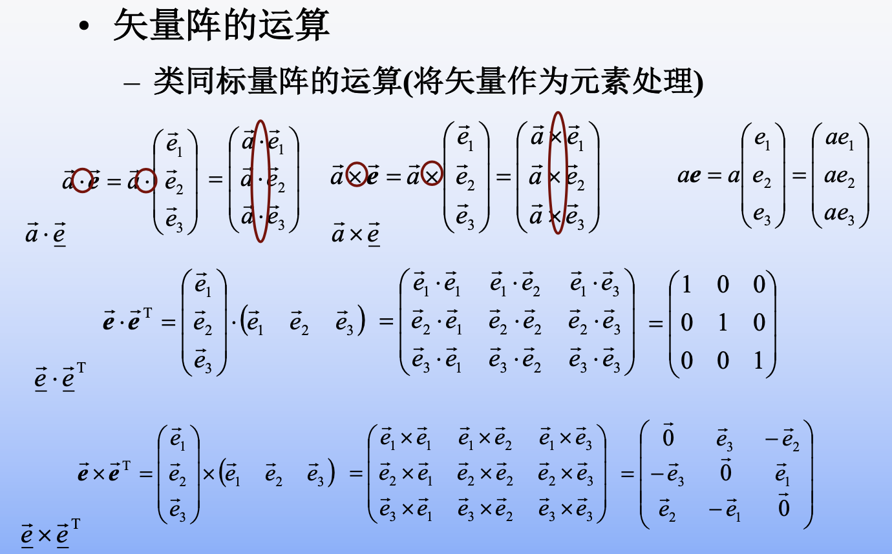
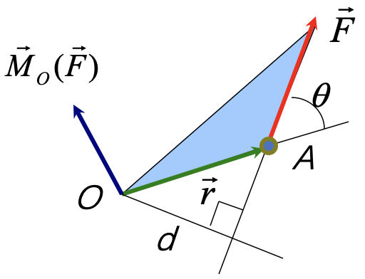
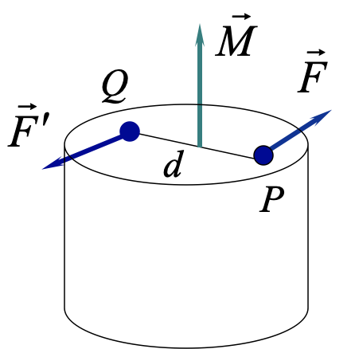
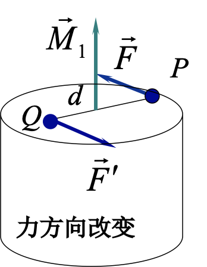
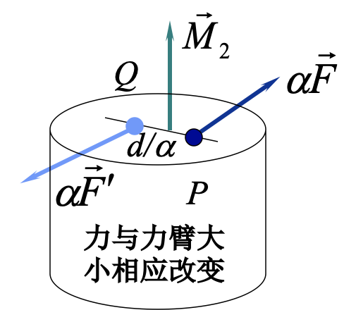
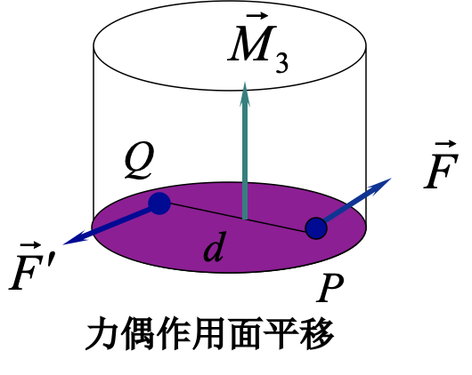
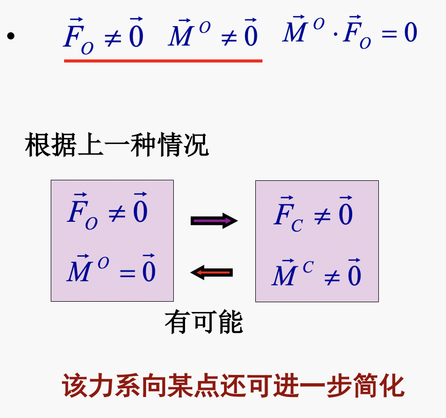

# 理论力学

[TOC]

## ch1 矢量运算

### 基本概念

**两重叉积** $\quad \vec{a} \times(\vec{b} \times \vec{c})=\vec{b}(\vec{a} \cdot \vec{c})-(\vec{b} \cdot \vec{a}) \vec{c}$
**混合积** $\quad \vec{a} \cdot(\vec{b} \times \vec{c})=\vec{c} \cdot(\vec{a} \times \vec{b})=\vec{b} \cdot(\vec{c} \times \vec{a})$

**矢量基**: 三个相互正交的矢量构成的三维空间
**基点**：原点O
**基矢量**：构成矢量基的三个单位矢量 $\quad \vec{e}_{1}, \quad \vec{e}_{2}, \quad \vec{e}_{3}$

**单位矢量** $\quad \vec{e}_{\alpha} \cdot \vec{e}_{\beta}=\delta_{\alpha \beta} \quad \alpha, \beta=1,2,3$
$$
\begin{array}{c}
\delta_{\alpha \beta}=\left\{\begin{array}{ll}
1 & \text { 当 } \alpha=\beta \\
0 & \text { 当 } \alpha \neq \beta
\end{array}\right. \\

\vec{e}_{1} \cdot \vec{e}_{1}=\delta_{11}=1 & \vec{e}_{2} \cdot \vec{e}_{1}=\delta_{21}=0
\end{array}
$$

### 矢量列阵

定义
$$
\vec{e}=\left(\begin{array}{l}
\vec{e}_{1} \\
\vec{e}_{2} \\
\vec{e}_{2}
\end{array}\right)=\left(\begin{array}{lll}
\vec{e}_{1} & \vec{e}_{2} & \vec{e}_{3}
\end{array}\right)^{\mathrm{T}}
$$
**右旋正交**
$$
\vec{e}_{\alpha} \times \vec{e}_{\beta}=\varepsilon_{\alpha \beta \gamma} \vec{e}_{\gamma}
\\
\alpha, \beta, \gamma = 1,2,3
\\
\varepsilon_{\alpha \beta \gamma}=\left\{\begin{array}{ll}
+1 & \text { 当 } \alpha, \beta, \text { 依次循环 } \\
-1 & \text { 其余 }
\end{array}\right.
$$

#### 矢量阵的运算

### 矢量的代数描述（重点）

#### 坐标阵

$$
\boldsymbol{a}=\left(\begin{array}{lll}
a_{1} & a_{2} & a_{3}
\end{array}\right)^{\mathrm{T}}
$$
在给定的矢量基下，矢量与 其的坐标阵一一对应

坐标阵又称“代数矢量”

**<u>坐标阵和矢量的相互表示</u>**
$$
\begin{array}{r}
\boldsymbol{a}=\left(\begin{array}{l}
a_{1} \\
a_{2} \\
a_{3}
\end{array}\right)=\left(\begin{array}{l}
\vec{a} \cdot \vec{e}_{1} \\
\vec{a} \cdot \vec{e}_{2} \\
\vec{a} \cdot \vec{e}_{3}
\end{array}\right)=\vec{a} \cdot\left(\begin{array}{l}
\vec{e}_{1} \\
\vec{e}_{2} \\
\vec{e}_{3}
\end{array}\right) 
\end{array}
$$

$$ {相互转换}
\boldsymbol{a}=\vec{a} \cdot \vec{e}=\vec{e} \cdot \vec{a}
\\
\vec{\boldsymbol{a}}=\vec{\boldsymbol{e}}^{\mathrm{T}} \boldsymbol{a}
\\
\vec{\boldsymbol{a}}={\boldsymbol{a}}^{\mathrm{T}} \vec{\boldsymbol{e}}
$$

#### 坐标方阵

反对称阵
$$
\tilde{\boldsymbol{a}}=\left(\begin{array}{ccc}
0 & -a_{3} & a_{2} \\
a_{3} & 0 & -a_{1} \\
-a_{2} & a_{1} & 0
\end{array}\right)
$$

#### 矢量运算和坐标阵的运算（*）

矢量式
$$
\begin{array}{c}
\vec{a}=\vec{b} \\
\vec{c}=\vec{a}+\vec{b} \\
\vec{c}=\alpha \vec{a} \\
\alpha =\vec{a} \cdot \vec{b}=\vec{b} \cdot \vec{a} \\
\vec{c}=\vec{a} \times \vec{b}=-\vec{b} \times \vec{a}
\end{array}
$$
坐标阵运算式
$$
\begin{array}{c}
a=b \\
c=a+b \\
c=\alpha a \\
\alpha=a^{\mathrm{T}} b=b^{\mathrm{T}} a \\
c=\tilde{a} b=-\tilde{b} a
\end{array}
$$

### 平面矢量

**定义**

- 当所有的矢量的变化与运算均发生在同一平面内

- 这些矢量仅可能与 <u>**垂直**</u> 于该平面的矢量发生运算

- 这些矢量的代数描述可在一个二维空间中进行

**平面矢量基**
基矢量 $\vec{x}$ 与 $\vec{y}$ 构成一平面矢量基 $\overrightarrow{\boldsymbol{e}}$
$$
\overrightarrow{\boldsymbol{e}}=(\vec{x},  \vec{y})^{\mathrm{T}}
$$
垂直于该平面的单位矢量记为 改 且
$$
\vec{z}=\vec{x} \times \vec{y}
$$
单位矢量 $\vec{Z}$ 称法矢量

$$
\begin{aligned}
&\boldsymbol{c}=\tilde{\boldsymbol{a}} \boldsymbol{b}=\left(\begin{array}{ccc}
0 & 0 & a_{y} \\
0 & 0 & -a_{x} \\
-a_{y} & a_{x} & 0
\end{array}\right)\left(\begin{array}{c}
b_{x} \\
b_{y} \\
0
\end{array}\right)=\left(\begin{array}{c}
0 \\
0 \\
a_{x} b_{y}-a_{y} b_{x}
\end{array}\right)\\
&\text { 矢量 } \vec{c}=\vec{a} \times \vec{b} \text { 的模 } \quad c=a_{x} b_{y}-a_{y} b_{x}
\end{aligned}
$$

$$
\vec{c}=\left(a_{x} b_{y}-a_{v} b_{x}\right) \vec{z}
$$

$$
引入反对称阵\quad \tilde{I} \stackrel{\text { def }}{=}\left(\begin{array}{cc}
0 & -1 \\
1 & 0
\end{array}\right)
\\
c=(\tilde{I} a)^{\mathrm{T}} b=\left[\left(\begin{array}{cc}
0 & -1 \\
1 & 0
\end{array}\right)\left(\begin{array}{l}
a_{x} \\
a_{y}
\end{array}\right)\right]^{\mathrm{T}}\left(\begin{array}{l}
b_{x} \\
b_{y}
\end{array}\right)=a_{x} b_{y}-a_{y} b_                                                         {x}
$$

$$
\vec{c}=\vec{a} \times \vec{b}=(\tilde{\underline{I}}\underline{a})^{\mathrm{T}} \underline{b} \vec{z}
$$

#### 法矢量与平面矢量的叉积

矢量 $\hat{\vec{a}}$ 为矢量 $\vec{a}$ 绕法矢量逆时针旋转90度
$$
\hat{\vec{a}}=\vec{z} \times \vec{a}=-a_{y} \vec{x}+a_{x} \vec{y}
$$

$$
\hat{\boldsymbol{a}}=\left(\begin{array}{cc}
0 & -1 \\
1 & 0
\end{array}\right)\left(\begin{array}{l}
a_{x} \\
a_{y}
\end{array}\right)=\left(\begin{array}{c}
-a_{y} \\
a_{x}
\end{array}\right)
$$

反对称阵$\tilde{\boldsymbol{I}}$的性质
$$
\begin{array}{l}
\tilde{\boldsymbol{I}}^{\mathrm{T}}=-\tilde{\boldsymbol{I}} \\
\widetilde{\boldsymbol{I}}=-\boldsymbol{I} \\
\tilde{\boldsymbol{I}}^{\mathrm{T}} \tilde{\boldsymbol{I}}=\tilde{\boldsymbol{I}} \tilde{\boldsymbol{I}}^{\mathrm{T}}=\boldsymbol{I}
\end{array}
$$

$$
\begin{array}{r}
\tilde{I}=\left(\begin{array}{cc}
0 & -1 \\
1 & 0
\end{array}\right) \\
\left(\begin{array}{cc}
0 & -1 \\
1 & 0
\end{array}\right)\left(\begin{array}{cc}
0 & -1 \\
1 & 0
\end{array}\right)=\left(\begin{array}{cc}
-1 & 0 \\
0 & -1
\end{array}\right) \\
\left(\begin{array}{cc}
0 & 1 \\
-1 & 0
\end{array}\right)\left(\begin{array}{cc}
0 & -1 \\
1 & 0
\end{array}\right)=\left(\begin{array}{cc}
1 & 0 \\
0 & 1
\end{array}\right)
\end{array}
$$

作业：1-18,1-20

## Ch2 静力学

力学量：力和**力偶**，力矩是描述力的转动效果，是一个数学量

### 力的性质

- 力作用效果取决于力的大小、方向与作用点(三要素)

- 静力学公理一：<u>同一个作用点</u> 两个力的效应可由一个力等效

- 静力学公理二：作用于**刚体**上两个力使其平衡的充分必要条件是两力处于同一直线上，且大小相等方向相反

- 静力学公理三：在一个力系上加减一个平衡力系不改变原力系对**刚体**的作用效果   

  推论：

  > 刚体：力可以沿着力的作用点移动。力对刚体作用的效果取决于力的大小、方向与**<u>作用线</u>**。该力是滑移矢量
  >
  > 变形体：力作用效果取决于力的大小、方向与**作用点**，该力为定位矢量。

  

  

  

- 作用力与反作用力同时存在，大小相等方向相反，沿同一条作用线，作用在**不同的物体上**

### 力系

**分类**：空间力系/平面力系、汇交力系/平行力系（力偶系）/一般力系

合成：滑移、合成，可用等号
$$
合力\quad \vec{F}_{O}=\left(\vec{F}_{1}, \vec{F}_{2}, \vec{F}_{3}\right)
$$

$$
矢量和/主矢\quad \vec{F}_{\mathrm{R}}=\sum_{i=1}^{n} \vec{F}_{i}
$$

F~O~合力是一个**定位矢量**，有作用点O 点。但是矢量和F~R~是一个**自由矢量**，没有定位点，只有数学意义，只能写为
$$
\vec{F}_{\mathrm{R}}  \tilde{}\left(\vec{F}_{1}, \vec{F}_{2}, \vec{F}_{3}\right)
$$

**合力方向**

$\alpha , \beta, \gamma$为与x,y,z 轴的夹角
$$
\begin{array}{l}
\alpha=\angle\left(F_{O}, \vec{x}\right)=\arccos \left(F_{O x} / F_{O}\right) \\
\beta=\angle\left(F_{O}, \vec{y}\right)=\arccos \left(F_{O y} / F_{O}\right) \\
\gamma=\angle\left(F_{O}, \vec{z}\right)=\arccos \left(F_{O z} / F_{O}\right)
\end{array}
$$

### 力矩

三要素：大小、方向、作用线

右手法则，定位矢量，在O 点上             
$$
\begin{array}{l}
&\vec{M}_{o}(\vec{F})&=\vec{r} \times \vec{F}
\\
大小：\quad &M_{o}(\vec{F})&=\left|\vec{M}_{o}(\vec{F})\right|=F r \sin \theta=F d(力臂)
\end{array}{}
$$

$$
\left(\begin{array}{c}
M_{O x}(\vec{F}) \\
M_{O y}(\vec{F}) \\
M_{O z}(\vec{F})
\end{array}\right)=\left(\begin{array}{ccc}
0 & -z & y \\
z & 0 & -x \\
-y & x & 0
\end{array}\right)\left(\begin{array}{c}
F_{x} \\
F_{y} \\
F_{z}
\end{array}\right)
$$

$$
\begin{array}{l}
M_{O x}(\vec{F})=y F_{z}-z F_{y} \\
M_{o y}(\vec{F})=z F_{x}-x F_{z} \\
M_{O z}(\vec{F})=x F_{y}-y F_{x}
\end{array}
$$

$$
\left|\begin{array}{lll}
i & j & k \\
x & y & z \\
F_{x} & F_{y} & F_{z}
\end{array}\right|
$$

**平面力矩计算**
$$
\begin{array}{l}
M_{o}(\vec{F})=(\widetilde{\boldsymbol{I}} \boldsymbol{r})^{\mathrm{T}} \boldsymbol{F}=x F_{y}-y F_{x} \\
\boldsymbol{r}=\left(\begin{array}{cc}
x & y
\end{array}\right)^{\mathrm{T}} \quad \boldsymbol{F}=\left(\begin{array}{ll}
F_{x} & F_{y}
\end{array}\right)^{\mathrm{T}}
\end{array}
$$

力对轴的矩是标量，力对点的矩是矢量

<u>**力对轴的矩：**</u>力对某轴的矩，等于力在垂直于该轴的平面上的分力对该轴与此平面交点的力矩的大小。

即将力分解成平行轴和垂直轴的量，求垂直轴的力的矩

1）力对轴的矩，是代数量，正负由右手螺旋法则确定；

2）力作用线与轴平行或相交（即力与轴共面）时，力对该轴的矩为零；

3）力沿其作用线移动时，力对轴的矩不变。

> 2)证明：1.平行 2.共起点  --》1&2 ：共面
>
> 
>
> 
> $$
> 左：\quad M_{O z}(\vec{F})=x F_{y}-y F_{x}=0
> \\
> 右：\quad M_{O_{y}}(\vec{F})=z F_{x}-x F_{z}=0
> $$

**合力矩定理**

**平面汇交力系**的合力对平面内任意一点之矩，等于其所有分力对于同一点之矩的代数和。（可以先求合力再再求力矩）
$$
\text {坐标式 } \quad \boldsymbol{M}_{O}(\vec{F})=\boldsymbol{M}_{O}\left(\vec{F}_{x}\right)+\boldsymbol{M}_{O}\left(\vec{F}_{y}\right)+\boldsymbol{M}_{O}\left(\vec{F}_{z}\right)
$$

### 力偶

**定义：**大小相等，方向相反

力和力偶不可等效

**作用效果：**转动和扭曲

**力偶的三个基本要素**

1. 作用面： 两力构成的平面
2. 力臂：两力作用线的距离
3. 转动方向：两力构成的旋转效应的方向

#### 力偶对任意点O的矩之矢量和

$$
\begin{aligned}
&\vec{r}_{P} \times \vec{F}+\vec{r}_{Q} \times \vec{F}^{\prime}  \\
&=\vec{r}_{P} \times \vec{F}-\vec{r}_{Q} \times \vec{F} \\
&=\left(\vec{r}_{P}-\vec{r}_{Q}\right) \times \vec{F}=\vec{r} \times \vec{F}\\&定义：\\
&\vec{M}=\vec{r}_{Q P} \times \vec{F}_{P}
\end{aligned}
$$

$\vec{M}$是一个自由矢量,力偶矢量相同，转动效果一样。下面四个$\vec{M}$都相同。相同力偶对应的力系不唯一。（变形体的力偶不是自由矢量）

特性：力偶在任意方向投影代数和为0（正负抵消了），力合成不考虑外力偶。

$\vec{M}$等于力$\vec{F}$  对点 *Q* 的矩,但是力矩是定位矢量，数值相等而已。

#### 力偶系及其合成

$\boldsymbol{n} \uparrow$ 力偶的集合构成力偶系 $\quad\left(\vec{M}_{1}, \vec{M}_{2}, \cdots, \vec{M}_{n}\right)$
合力偶矩
$$
\vec{M}=\sum_{i=1}^{n} \vec{M}_{i}
$$
**合力偶矩等于力偶系所有力偶矩的矢量和** 

合力偶矩矢量坐标式 $\quad \boldsymbol{M}=\sum_{i=1}^{n} \boldsymbol{M}_{i} \quad \boldsymbol{M}=\left(\begin{array}{lll}M_{x} & M_{y} & M_{z}\end{array}\right)^{\mathrm{T}}$

**合力偶矩的坐标等于力偶系各力偶矩对应坐标的代数和**

参考基 $\quad \overrightarrow{\boldsymbol{e}}=(\vec{x} \quad \vec{y} \quad \vec{z})^{\mathrm{T}} \quad \boldsymbol{M}_{i}=\left(\begin{array}{lll}M_{i x} & M_{i y} & M_{i z}\end{array}\right)^{\mathrm{T}}$
$$
M_{x}=\sum_{i=1}^{n} M_{i x} \quad M_{y}=\sum_{i=1}^{n} M_{i y} \quad M_{z}=\sum_{i=1}^{n} M_{i z}
$$
### 力系的简化

力系简化为作用在简化中心的合力和合力偶。

力矢量在刚体上**沿作用线**移动不改变对刚体的作用效果
**力的作用线**作平行移动，会改变它对刚体的作用效果（必须要加一个力偶）

#### 主矢

$$
\vec{F}_{\mathrm{R}}=\sum_{i=1}^{n} \vec{F}_{i}
$$

#### 主矩

力系所有力对某点*O*的矩之矢量和称为该力系对某点*O*的主矩
$$
\vec{M}_{O}=\sum_{i=1}^{n} \vec{M}_{o}\left(\vec{F}_{i}\right)=\sum_{k=1}^{n} \vec{r}_{k} \times \vec{F}_{k}
$$
主矩是宝位矢量，与矩心绑定

向简化中心O的简化

1. 平移力， 力叠加
2. 平移需要添加一个外力偶（数值就是这个力对应的力矩）
3. 力偶叠加

### 简化力偶的关系

$$
主矢相同\\
\vec{M}^{C}=\vec{M}^{O}+\vec{M}_{f}^{C}=\vec{M}^{O}+\vec{r}_{C O} \times \vec{F}_{O}
$$

$$
\begin{aligned}
&\begin{array}{c}
\left(\vec{F}_{1}, \vec{F}_{2}, \cdots, \vec{F}_{n}\right)=\left(\vec{F}_{0}, \vec{M}^{0})=\left(\vec{F}_{C}, \vec{M}^{0}\right)\right. \\
\vec{F}_{C}=\vec{F}_{O}=\vec{F}_{\mathrm{R}}=\sum_{i=1}^{n} \vec{F}_{i} \\
\vec{M}^{C}=\vec{M}^{O}+\vec{r}_{C O} \times \vec{F}_{O}
\end{array}\\
&\text { 不变量 }\\
&\vec{M}^{C} \cdot \vec{F}_{C}=\left(\vec{M}^{O}+\vec{r}_{C O} \times \vec{F}_{O}\right) \cdot \vec{F}_{C}
\end{aligned}
$$

**力系简化的几种结果**
$$
\vec{M}^{C} \cdot \vec{F}_{C}=\left(\vec{M}^{O}+\vec{r}_{C O} \times \vec{F}_{O}\right)
$$

1. 与简化结果与简化中心无关
   1. 力系平衡  $\vec{F}_{O}=\overrightarrow{0} \quad \vec{M}^{O}=\overrightarrow{0}$

      力系对点C的简化结果 $\quad \vec{F}_{C}=\overrightarrow{0} \quad \vec{M}^{C}=\overrightarrow{0}$
      简化结果与简化中心无关 相当于无力与力偶作用 $\quad$ 力系平衡

   2. 转动力系 
      $$
      \vec{F}_{O}=\overrightarrow{0} \quad \vec{M}^{o} \neq \overrightarrow{0}\\
      \vec{F}_{C}=\overrightarrow{0} \quad \vec{M}^{C}=\vec{M}^{O}
      $$

      简化结果与简化中心无关 $\quad$ カ系与一个合力偶等效

2. 简化结果与简化中心有关

   1. $\vec{F}_{o} \neq \overrightarrow{0} \quad \vec{M}^{o}=\overrightarrow{0}$
      力系对点 $C$ 的简化结果 $\quad \vec{F}_{C}=\vec{F}_{O} \quad \vec{M}^{C} \neq \vec{M}^{O}$
      简化结果与简化中心有关 力系只与作用于点O的合力等效 对于其他简化中心 $\quad \vec{F}_{C}=\vec{F}_{O} \quad \vec{M}^{C} \neq \overrightarrow{0}$
      力系的简化结果可能存在力偶
      $$
      \begin{array}{c}
      \vec{M}^{c} \cdot \vec{F}_{c}=\vec{M}^{o} \cdot \vec{F}_{O}=\overrightarrow{0} \\
      \vec{M}^{c} \perp \vec{F}_{C} \quad \vec{M}_{C} \perp \vec{F}_{\mathrm{R}}
      \end{array}
      $$
      因为点积为0，所以该力系的主矩或为零矢量，或与主矢垂直

      可能找一个C点，使得合力不为0，合力偶为0